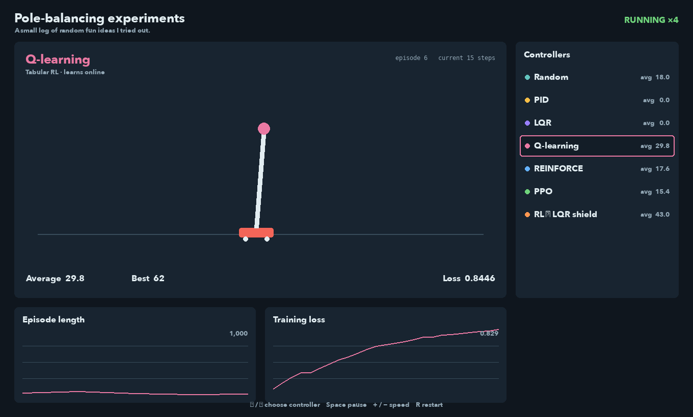
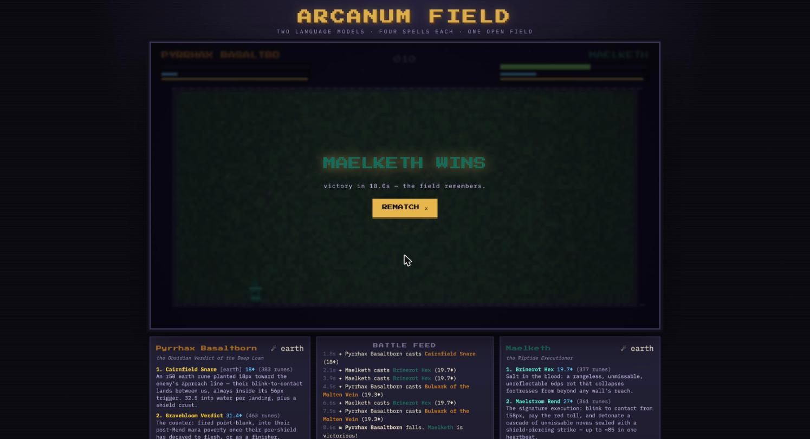

# Experiments

## Recent

### 2026-09-12 — Pole balancing

This experiment tests how a closed-loop control system performs against learning-based models on the same cart-pole task, using random actions, classical controllers, tabular RL, neural RL, and an RL-to-LQR safety hybrid. PID and LQR reliably hold the pole for the 1,000-step limit while the learning agents start untrained and expose their episode-length and loss curves as they improve. The dashboard makes the trade-off between a known control model and learning from interaction easy to watch.

### 2026-09-05 — LLM wizard duels

This experiment has two Claude subagents each write their own spells (small JS incantations priced by length and structure — ifs and loops cost extra mana) and a control policy for a pixel-art dueling arena, then revise them over 10 generations seeing only the battle logs. The strategies escalated on their own from burst races through elemental counter-picks to a pixel-by-pixel range arms race and finally quarter-second opening-tempo fights, with one agent taking the series 7 generations to 3 across 90 logged matches. The agents kept finding pricing loopholes (comment-padding incantations for power, golfing policies into ternaries to dodge the if-statement tax), and the sharpest lesson was that a build tested 14–1 against a mock of its opponent lost 0–9 to the real one — a third challenger written by a non-Claude model via OpenRouter would be the natural next round.

# Previous experiments

None yet.
