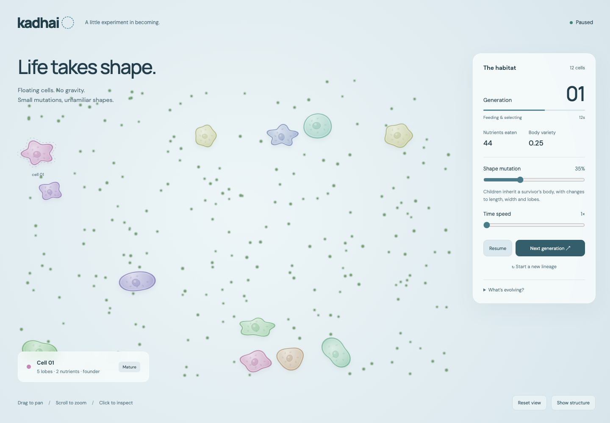
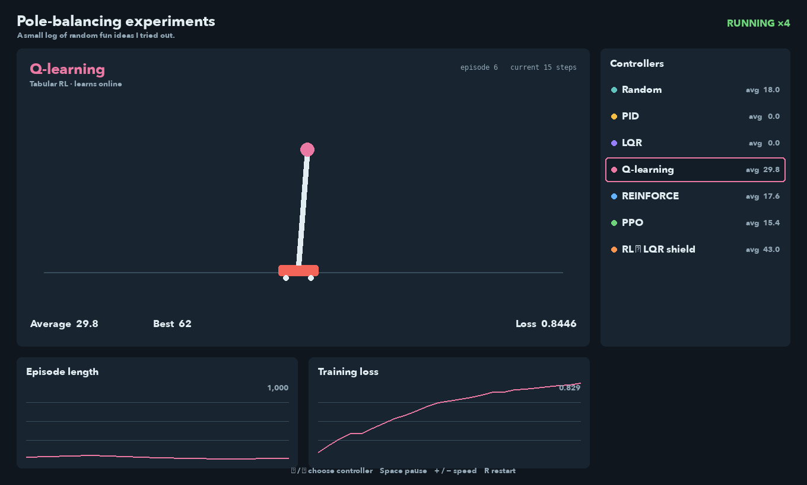
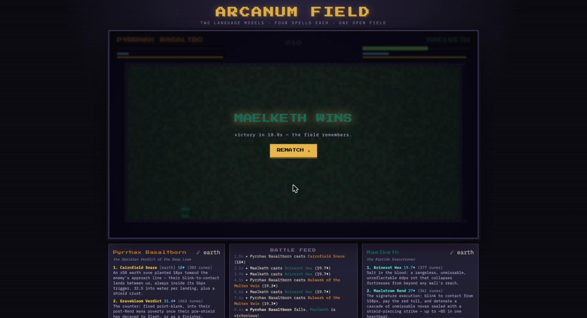

# Experiments

## Recent

### 2026-10-07 — Barnacle: a servo hexapod that prints onto things

This design turns eight spare 7.4 V hobby servos into a fixed-nozzle printer that prints onto existing curved objects. The specific job is tactile Braille labels on knobs, keycaps and caps. Six servos form a Stewart platform that tilts the object so each dot stands normal to the surface, one gutted servo becomes a closed-loop encoder extruder, and one deploys a surface probe. The kinematics model drove the geometry: steep legs keep the spot error near 0.04 mm for 0.1° of servo error, and per-arm springs keep the gears preloaded so backlash stays out (a single central spring failed this check). The cost is a small ±8.5 mm, ±18° workspace, which fits a "HOT" Braille label on a domed knob (all 720 poses are reachable). The parts and firmware are generated but not built yet, so the next step is printing it and measuring real servo deadband.

### 2026-09-13 — Kadhai: floating soft cells

This experiment uses Algovivo to float twelve soft 2D cells without gravity, grow their bodies, and pass mutated lengths, widths, and lobes from nutrient-gathering survivors to the next generation. The running browser capture shows mature cells with distinct outlines and 44 absorbed nutrients, while seeded solver checks completed three selection rounds without non-finite positions. Next, compare evolving populations with frozen-genome controls under identical nutrient fields to see whether shape selection helps rather than just changing appearances.

### 2026-09-12 — Pole balancing

This experiment tests how a closed-loop control system performs against learning-based models on the same cart-pole task, using random actions, classical controllers, tabular RL, neural RL, and an RL-to-LQR safety hybrid. PID and LQR reliably hold the pole for the 1,000-step limit while the learning agents start untrained and expose their episode-length and loss curves as they improve. The dashboard makes the trade-off between a known control model and learning from interaction easy to watch.

### 2026-09-05 — LLM wizard duels

This experiment has two Claude subagents each write their own spells (small JS incantations priced by length and structure — ifs and loops cost extra mana) and a control policy for a pixel-art dueling arena, then revise them over 10 generations seeing only the battle logs. The strategies escalated on their own from burst races through elemental counter-picks to a pixel-by-pixel range arms race and finally quarter-second opening-tempo fights, with one agent taking the series 7 generations to 3 across 90 logged matches. The agents kept finding pricing loopholes (comment-padding incantations for power, golfing policies into ternaries to dodge the if-statement tax), and the sharpest lesson was that a build tested 14–1 against a mock of its opponent lost 0–9 to the real one — a third challenger written by a non-Claude model via OpenRouter would be the natural next round.

# Previous experiments

None yet.
