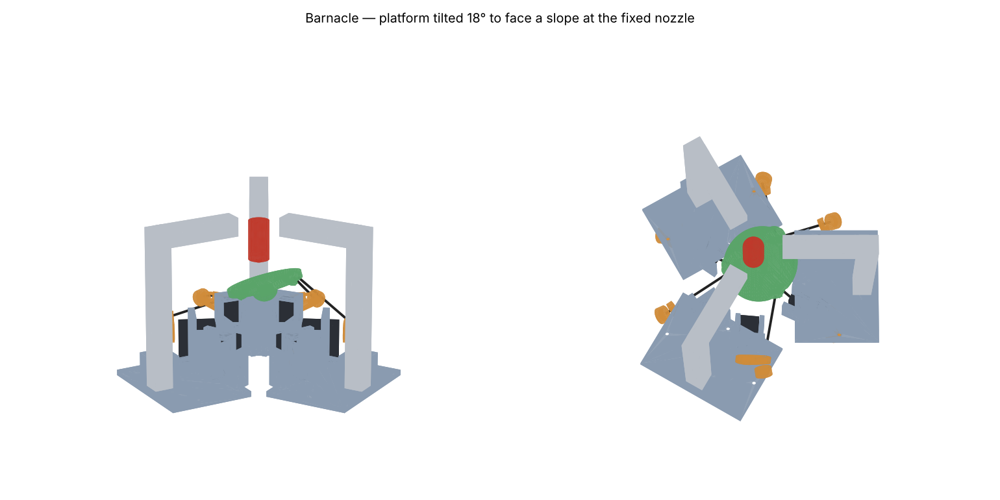
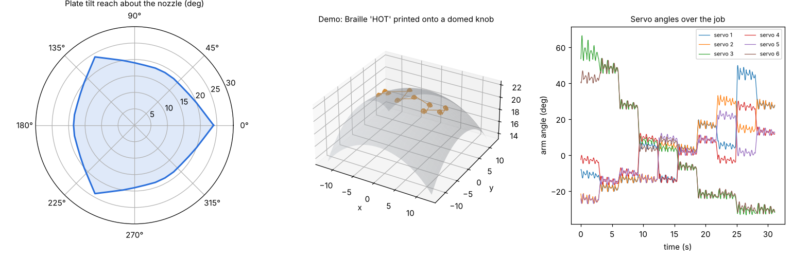

# Barnacle: a servo hexapod printer that prints *onto* things

Normal printers only print onto a flat bed. Barnacle prints onto objects you
already have, like a domed oven knob, a keycap, a pill-bottle cap or a TV
remote button. The specific problem it solves is **adding tactile Braille
labels and bumps to curved everyday controls**, so every dot stands
perpendicular to the surface it sits on.

The hotend never moves. Six of the eight 7.4 V servos form a Stewart platform
(hexapod) under the build plate. They tilt and shift the object in all six
axes until the spot being printed faces straight up into the nozzle.



## What each servo does

| # | Job | Notes |
|---|-----|-------|
| 1–6 | Hexapod legs | Magnetic ball joints, adjustable rods, spring-preloaded arms |
| 7 | Extruder | Control board removed. Its motor and gearbox drive an MK8 gear, an AS5600 magnetic encoder closes the loop, and a DRV8871 drives the motor |
| 8 | Surface probe | Swings a micro switch down next to the nozzle so the machine can map the object's real surface before it prints |

## Why it is shaped this way (the numbers)

Everything below comes from `python3 analyze.py`, which uses the same
`Geometry` that generates the STLs.

* **Hobby servos are coarse, so the geometry has to make up for it.** A good
  digital servo resolves about 0.1°. On a typical hexapod with long, upright
  legs that becomes about 0.5 mm of lateral error. A search over the geometry
  settled on a big base (r = 100), a small platform (r = 38), short 80 mm rods
  and 20 mm arms. With those steep legs, 0.1° of servo error moves the printed
  spot by **0.04 mm at home and at most 0.11 mm over the demo job**.
* **Backlash is the real enemy, so it is preloaded out.** If 0.5° of gear slop
  were left in, the error would be 0.19 mm. Each servo arm therefore has its
  own 8 N extension spring pulling down, so every gear train stays loaded the
  same way. The analysis checks every pose of the demo: the spring always beats
  the rod load, with at least 67 N·mm of margin.
  *I tried one central spring first. It failed: at tilted poses some rods went
  into tension and the servos reversed direction.*
* **Magnetic ball joints** (10 mm steel balls in 12×4 mm countersunk N52
  magnets) allow 45° of swing. M3 ball links bind at about 30°, which capped
  the tilt at 19°. The worst rod pull in the demo is 4 N, inside the ~8 N the
  magnets hold.
* **Servo load is light.** Peak torque is 0.19 N·m, about 10% of stall for a
  20 kg·cm servo, so the servos run cool and are not fighting for position.
* **The honest trade-off is a small workspace.** The plate can tilt at least
  18.5° in every direction (24° in the best direction) about the nozzle, but
  it can only shift about ±8.5 mm sideways. That suits Braille labels (a
  three-letter word is about 15 mm wide). It does not suit printing a vase.



The demo job prints Braille "HOT" onto a knob shaped like a sphere of radius
22 mm. Each dot is a 1.5 mm dome made of four conformal layers. It has 720
poses and all of them are reachable, using up to 20.5° of tilt. The result is
`demo_braille.csv` (time, six servo pulse widths, and extruder mm), which
`stream.py` sends to the controller.

## Files

| File | What it is |
|------|------------|
| `kinematics.py` | Geometry, inverse kinematics, ball-joint limits, error and statics models |
| `analyze.py` | Reach, accuracy, preload and demo-job checks; writes `assets/analysis.png` and `demo_braille.csv` |
| `parts.py` | Generates every printed part as STL from the same geometry (`stl/`) |
| `render.py` | Assembly preview |
| `firmware/main.py` | MicroPython for a Raspberry Pi Pico: 7 servo outputs at 250 Hz, extruder PI loop, probe, hotend PID with thermistor-fault cutoff |
| `stream.py` | Streams a pose CSV to the Pico over USB serial |

```
pip install numpy manifold3d trimesh matplotlib
python3 analyze.py      # check the design
python3 parts.py        # regenerate STLs after changing any dimension
```

## Printed parts (PETG or ASA, 4 walls, 40% gyroid)

| Part | Qty | Notes |
|------|-----|-------|
| `pod` | 3 | Holds a servo pair and the foot of a column. About 105 × 125 mm |
| `arm_a`, `arm_b` | 3 + 3 | Mirror pair; bolt to the servo's aluminium disc horn |
| `platform` | 1 | Six magnet cups; 70 mm magnetic PEI disc on top |
| `hub`, `hub_cap` | 1 + 1 | Clamp a V6-style groove mount at the centre of the crown |
| `elbow` | 3 | Join the 2020 columns to the 2020 spokes; slide them to set nozzle height |
| `extruder_body`, `coupler` | 1 + 1 | Servo 7 to a 5 mm shaft on two 625 bearings |
| `probe_arm` | 1 | Servo 8 disc horn to a KW10 micro switch |

## Other hardware

* 8 × your 7.4 V servos, plus their aluminium disc horns (25T)
* 12 × 10 mm steel balls tapped M3, 12 × 12×4 mm countersunk N52 ring magnets, 6 × M3 threaded rod about 60 mm long (sets the 80 mm ball-to-ball length)
* 6 × light extension springs (~8 N at working length) from each arm tip down to a screw in the board
* 3 × 2020 extrusion about 200 mm (columns), 3 × about 90 mm (spokes), M4 screws and T-nuts, a 300 mm plywood board
* V6-style hotend (24 V), MK8 drive gear, 5 mm shaft, 2 × 625 and 1 × 623 bearings, an AS5600 with a diametric magnet, a DRV8871
* Raspberry Pi Pico, MOSFET module for the heater, 100 k NTC thermistor with a 4.7 k pull-up resistor
* Power: a **7.4–8.4 V, 10 A** supply or a 2S LiPo for the servos, and a 24 V supply for the hotend, with their grounds joined

## Assembly and calibration

1. Before fitting the horns, command every servo to 1500 µs. Then fit the
   arms as close to horizontal as the spline allows.
2. Set every rod to exactly 80.0 mm ball centre to ball centre. They have to
   match, so use calipers.
3. Calibrate each servo: sweep it and read the arm angle with a phone
   inclinometer. Fit a centre and µs-per-degree for each servo, then put those
   into `pulses_us`. This also confirms which way each servo turns. Any error
   left here shows up directly as position error.
4. Hook up the arm springs and check that the backlash is gone. Rock the plate
   by hand: it should feel springy, not clunky.
5. Slide the crown so the nozzle tip sits at the top of the object, and set
   `nozzle_above_plate` to match.
6. Probe the object (`PROBE` at a grid of poses) and fit its surface. Then
   generate dots onto *that* surface rather than an ideal one.

## Known gaps and next steps

* The firmware and the parts have not been run or printed yet. This is a
  design that checks out on paper and in CAD, not a proven machine.
* The servo and horn dimensions are typical standard-size values. Measure
  yours and edit the constants at the top of `parts.py`.
* Printed plastic needs to stick to the object. PETG sticks well to ABS/PC
  keycaps and knobs that have been lightly sanded. Glass and metal need a
  primer.
* The analysis checks collisions only between the arms and the pods. A check
  between the heater block and the tilted plate is the next thing to add.
* A small turntable on the plate would remove the ±8.5 mm limit for round
  objects, but it would need a ninth servo.
