# BISCAD technical handbook

**The CAD kernel for agents.** build123d / OpenCascade behind a REST API and an MCP
server, with a web viewer, a studio, and outputs built for humans to oversee what
agents make.

This handbook takes you from zero to deep understanding of the whole system. It
explains every component, the theory behind it, the design decisions and their
trade-offs, and it links to the code. Read it top to bottom once. After that, use the
table of contents to jump.

Prose follows `.construction/how-to-write-prose.md`: short active sentences, concrete
nouns, units on numbers. Code citations use file paths, not line numbers, because the
server modules are being renamed (behaviour unchanged) while this is written.

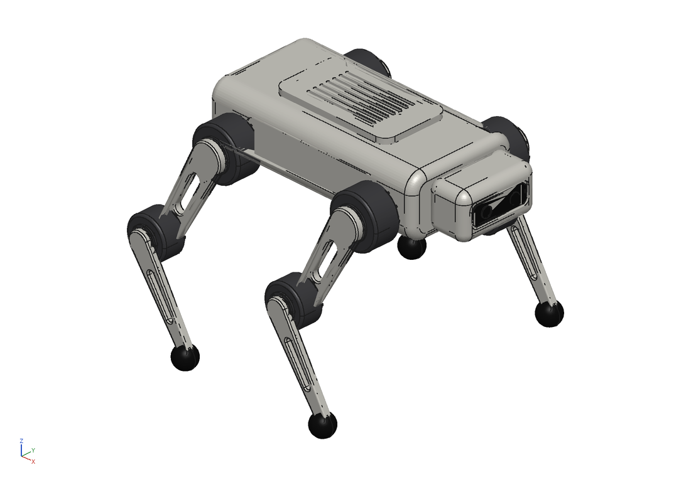

---

## Contents

1. [Why BISCAD exists](#1-why-biscad-exists)
2. [System architecture](#2-system-architecture)
3. [Geometry kernel primer](#3-geometry-kernel-primer)
4. [Stable references and the topological naming problem](#4-stable-references-and-the-topological-naming-problem)
5. [Tessellation and the scene format](#5-tessellation-and-the-scene-format)
6. [Headless rendering](#6-headless-rendering)
7. [Sandbox security](#7-sandbox-security)
8. [Build-step capture](#8-build-step-capture)
9. [Analysis algorithms](#9-analysis-algorithms)
10. [Exports, imports and drawings](#10-exports-imports-and-drawings)
11. [Text-to-CAD agent loop and MCP tool design](#11-text-to-cad-agent-loop-and-mcp-tool-design)
12. [Web viewer and studio internals](#12-web-viewer-and-studio-internals)
13. [Data model, accounts, quotas, versions](#13-data-model-accounts-quotas-versions)
14. [Performance: measured numbers](#14-performance-measured-numbers)
15. [Deployment and scaling](#15-deployment-and-scaling)
16. [Testing strategy](#16-testing-strategy)
17. [Roadmap](#17-roadmap)
18. [Glossary](#18-glossary)
19. [Reading list](#19-reading-list)

---

## 1. Why BISCAD exists

### The Onshape API wall

Onshape is a cloud CAD system with a public REST API. The API is good. The limit on
how much you may call it is the problem.

Onshape caps API calls per user per year. The documented limits are:

| Plan | Annual API call limit |
|---|---|
| Free / Standard / EDU student | 2,500 per user |
| Professional | 5,000 per user |
| Enterprise | 10,000 per full user |

Source: the Onshape API documentation on limits
(`onshape-public.github.io/docs/auth/limits`). When a user passes the annual limit,
Onshape rejects further calls with HTTP 402 (Payment Required). The pricing page
(`onshape.com/pricing`) lists Standard at $1,500 per user per year and Professional at
$2,500 per user per year. So a Professional seat costs $2,500 per year and grants 5,000
API calls in that year.

Count what a call is. Reading a document is a call. Starting a feature is a call.
Reading back the result is a call. A single "make this change and tell me what it did"
round trip is several calls.

### Agents do not iterate like people

A person edits a CAD model a few times a minute. An agent does not. An agent writes
code, builds it, looks at the result, finds the hole is in the wrong place, moves the
hole, builds again. It does this in a tight loop, as fast as the kernel answers.

A text-to-CAD agent run in BISCAD is 2 to 4 build rounds. A session that explores a
design space is hundreds of builds per hour. At that rate a Professional Onshape seat's
whole annual allowance of 5,000 calls is gone in an afternoon. The pricing model
assumes a human at a mouse. It breaks the moment the caller is a program.

BISCAD is priced per build instead of per seat. A build is a few hundred milliseconds of
one CPU core (Section 14). On autoscaling infrastructure that is a fraction of a cent
(Section 15). An agent can iterate hundreds of times an hour for the cost of a coffee,
not a software licence.

### Code as CAD, with build123d

BISCAD does not try to clone Onshape's feature tree UI. It takes a different base:
**the model is a program**.

[build123d](https://build123d.readthedocs.io) is a Python CAD library on top of
OpenCascade (OCCT), the same B-rep kernel that FreeCAD and many commercial tools use.
A part is Python code:

```python
from build123d import *
with BuildPart() as bracket:
    Box(60, 40, 6)
    fillet(bracket.edges().filter_by(Axis.Z), 3)
    with GridLocations(40, 24, 2, 2):
        Hole(3.25)
result = bracket.part
```

Code as the source of truth has properties agents love:

- It is text. A language model writes it, reads it, diffs it, and reasons about it.
- It is parametric by construction. A variable is a parameter. No special UI needed.
- It is deterministic. The same program and the same inputs give the same solid.
- It is versionable with ordinary tools.

The trade-off is that the user must think in code, not in direct manipulation. For a
human that is a cost. For an agent it is the native tongue.

### Humans still need to understand the output

Andrej Karpathy's point about working with large language models is that the hard part
is not getting the model to produce output. It is the human staying in the loop:
checking, trusting, and correcting what the model made. Output you cannot inspect is
output you cannot trust.

A wall of geometry numbers is not inspectable. So BISCAD spends real effort on making an
agent's work legible to a person:

- **Renders the agent can see** (Section 6): any view, with face-id labels, so a
  multimodal model checks its own geometry and a person checks it too.
- **Stable references** (Section 4): every face and edge has a name like `p0/f3` that is
  the same in the viewer, the REST API and the MCP tools. A person and an agent point at
  the same face with the same word.
- **Build-step replay** (Section 8): one plain-English line per operation, with a
  thumbnail, so you read how the part was built the way you read a recipe.
- **Design reports and explainer GIFs** (Section 11, `server/explainer.py`): one page
  that shows the part, the steps, the mass, and the manufacturability check.

The thesis of BISCAD: an AI makes the geometry, the human oversees it, and the tooling
exists to make that oversight fast.

---

## 2. System architecture

### Components

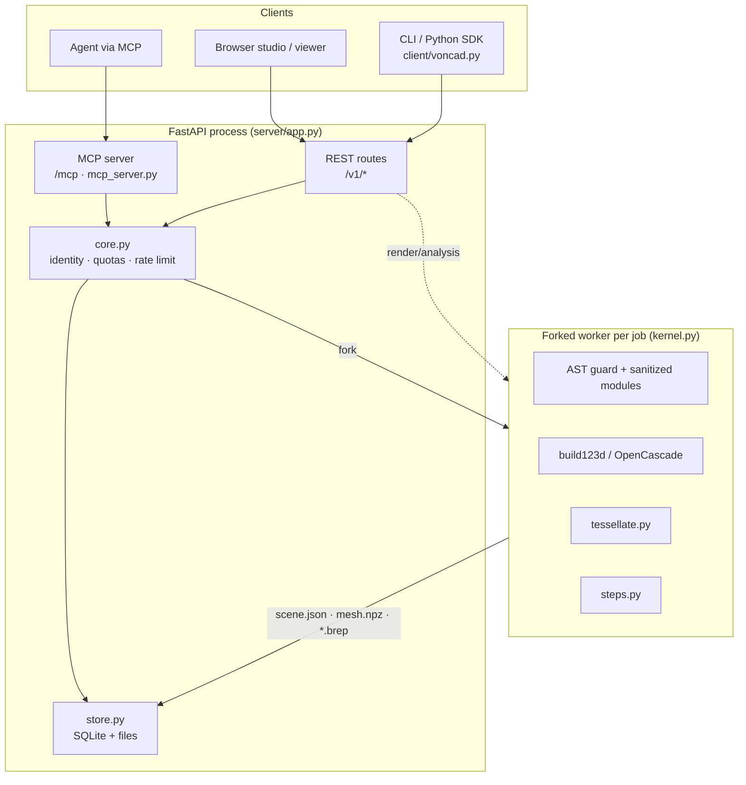

The whole backend is one FastAPI process. It serves three faces of the same core logic:

- **REST** (`server/app.py`): the HTTP API. Contract in `README.md` / `PROGRESS.md`.
- **MCP** (`server/mcp_server.py`): the same operations as tools an agent calls, mounted
  at `/mcp`. Renders come back as real images.
- **Static web** (`web/`): the landing page, studio, embeddable viewer, and docs.

Shared business logic lives in `server/core.py` so REST and MCP never drift apart. Both
call `core.build`, `core.measure`, and so on. Identity, rate limiting and quotas are
decided once, in `core.py`, for every caller.

The kernel is isolated. Every build and every analysis runs in a forked child process
with resource limits (Section 7). The parent process never runs untrusted code in its
own interpreter.

### The lifecycle of POST /v1/build

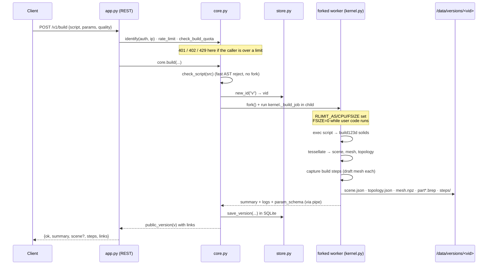

Steps worth noting:

1. **Cheap reject first.** `core.build` calls the AST guard before it forks. A script
   that imports `os` fails in microseconds, with no process spawned.
2. **One capability id.** The version id (`v_...`) is minted before the build. It names
   both the SQLite row and the on-disk directory `data/versions/<vid>/`.
3. **Fork, not spawn.** build123d and OpenCascade are already imported in the parent.
   `fork()` copies that warm memory, so the child starts ready. Spawning a fresh
   interpreter would re-import OCCT and cost over 2 seconds (measured; Section 14).
4. **Files are the build output.** The child writes `scene.json` (what the viewer
   draws), `topology.json` (what an agent reads), `mesh.npz` (what the renderer uses),
   and `part*.brep` (the exact B-rep for later exports and analysis). The parent never
   holds the geometry; it reads these files on demand.
5. **The result is a capability link.** The response carries URLs for the scene, render,
   report, exports and viewer. Anyone with the version id can view it (Section 13).

Render and analysis requests follow the same pattern: the parent forks a child that
loads the saved `.brep`, does the work, and returns JSON or an image.

---

## 3. Geometry kernel primer

To understand everything above the kernel, you need to understand the kernel's model of
shape. This section is the CAD theory. If you know OCCT already, skim it.

### Three ways to represent a solid

- **Mesh (boundary triangles).** A bag of triangles approximating the surface. Fast to
  draw, cheap to store, lossy. An STL file is a mesh. A mesh does not know it has a
  "hole" or a "cylinder"; it only has triangles. You cannot fillet a mesh edge exactly,
  because the mesh has no exact edge, only facets.
- **CSG (constructive solid geometry).** A tree of primitives combined with booleans:
  "box minus cylinder union sphere". OpenSCAD works this way. CSG is exact and simple to
  author, but it has no persistent notion of a face. "The top face" is not a thing the
  tree stores; it is recomputed every time.
- **B-rep (boundary representation).** The surface is stored as exact trimmed surfaces
  (planes, cylinders, NURBS) bounded by exact curves, stitched into a watertight shell.
  A B-rep knows its faces, edges and vertices as first-class objects with identity and
  exact geometry. This is what commercial CAD uses, and it is what OpenCascade is.

BISCAD is B-rep. Faces and edges are real objects you can name, measure, fillet and
select. The mesh (Section 5) is a derived view for drawing; the `.brep` file is the
truth.

### OpenCascade topology: TopoDS

OpenCascade (OCCT) splits a shape into **geometry** (the math of a surface or curve) and
**topology** (how pieces connect). Topology is the `TopoDS_Shape` hierarchy:

```
Compound  →  CompSolid  →  Solid  →  Shell  →  Face  →  Wire  →  Edge  →  Vertex
```

- A **Face** is a trimmed patch of one surface (a plane, a cylinder, a NURBS surface).
- A **Wire** is a loop of edges bounding a face. A face has one outer wire and zero or
  more inner wires (holes in the face).
- An **Edge** is a trimmed curve (a line, an arc, a spline) shared by two faces.
- A **Vertex** is a point where edges meet.

Two faces share one edge. The edge is stored once and referenced twice. This sharing is
what makes a B-rep watertight and is why topology and geometry are separate: the same
curve geometry can be referenced with either orientation by the two faces that meet
along it.

**Orientation matters.** Each face carries an orientation flag (`FORWARD` or
`REVERSED`) that tells you which side is "outside" the solid. The tessellator reads this
flag to wind triangles consistently and to flip surface normals so they point outward
(`tessellate.py`, `_mesh_face`, checks `TopAbs_REVERSED`). Get it wrong and the part
renders inside-out.

### build123d: builder mode vs algebra mode

build123d wraps OCCT in Pythonic form, and offers two authoring styles.

**Builder mode** uses a `with` context that collects operations into a running part:

```python
with BuildPart() as p:
    Box(40, 30, 10)
    Cylinder(5, 20, mode=Mode.SUBTRACT)
    fillet(p.edges().filter_by(Axis.Z), 2)
result = p.part
```

Operations like `extrude`, `Hole` and `fillet` add to the context implicitly. This is
the style BISCAD's step capture hooks into (Section 8), and it is what the text-to-CAD
agent is told to prefer, because it produces readable build steps.

**Algebra mode** uses plain operators on shape objects:

```python
result = Box(40, 30, 10) - Cylinder(5, 20)
```

Algebra mode is terse and functional. It produces no builder context, so BISCAD records
no step replay for it; the design report says so ("built in algebra mode"). Both modes
produce the same B-rep.

### Booleans, fillets, chamfers, and why they fail

**Booleans** (union, cut, intersect) are the core B-rep operation. OCCT's
`BRepAlgoAPI` intersects the two shells, finds the intersection curves, trims the faces,
and sews a new watertight shell. This is the single most expensive and most fragile
operation in the kernel. It is the top cost in a heavy build (Section 14: `BRepAlgoAPI`
was the largest single time sink in the profiled quadruped build).

**Fillets** round an edge by replacing it with a blend surface (a rolling-ball surface
of the given radius). **Chamfers** replace it with a flat bevel. Both are local surgery
on the B-rep: they remove the edge, build the new surface, and re-trim the neighbours.

They fail for real geometric reasons, not bugs:

- **Radius too large.** A fillet radius larger than the local feature leaves no room for
  the blend. The rolling ball self-intersects. OCCT throws, and BISCAD reports the line.
- **Convergent blends.** Fillets on edges that meet at a vertex must blend into each
  other. If three fillets of different radii meet, the corner patch may be unsolvable.
- **Tangent or near-tangent faces.** When the two faces meeting at an edge are nearly
  tangent, the blend surface is ill-conditioned.

Because they fail, BISCAD treats a failed build as a normal event. The error text and
the failing script line go back to the caller (and to the agent, which then shrinks the
radius and retries).

### Tolerance and validity

A B-rep is not infinitely precise. Two surfaces that should meet exactly meet within a
**tolerance** (typically 1e-7 to 1e-3 mm per vertex/edge/face). Tolerance accumulates
through booleans. A shape whose tolerances have grown too large, or whose faces no
longer sew into a closed shell, is **invalid**.

BISCAD checks validity with OCCT's `BRepCheck` (via `shape.is_valid()`) on every part
and reports it in the summary (`kernel.py`, `summarize_parts`) and in the DFM check
(`analysis.py`). An invalid solid will not export to STEP cleanly and may crash a
downstream tool, so catching it early matters. Validity checking is itself expensive: it
was the second-largest cost in the profiled build (Section 14).

---

## 4. Stable references and the topological naming problem

### How p0/f3 is assigned

Every face, edge and vertex in BISCAD has a stable-looking name:

```
p0/f3   =  part 0, face index 3
p0/e7   =  part 0, edge index 7
p0/v2   =  part 0, vertex index 2
```

The index is the position of that entity in build123d's `shape.faces()` /
`shape.edges()` / `shape.vertices()` list. build123d builds those lists by walking the
OCCT topology with `TopExp_Explorer`, which visits sub-shapes in a deterministic order
for a given shape. So `p0/f3` is exactly `result.faces()[3]` for a single part.

This is the whole point: one naming scheme, used everywhere.

- A script selects `part.faces()[3]`.
- The REST topology endpoint returns `{"id": "p0/f3", ...}`.
- The viewer's GPU picker returns `p0/f3` when you click that face.
- An agent says "fillet `p0/f3`" and the human sees the same face highlighted.

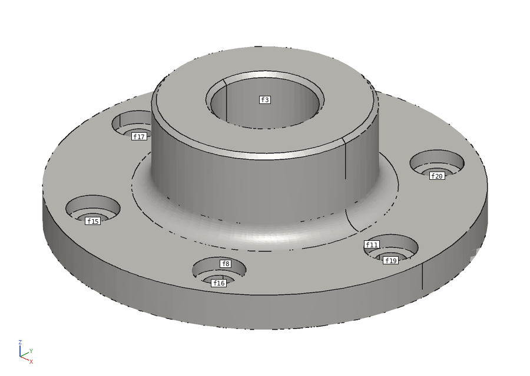

The assignment lives in `tessellate.py` (`mesh_shape` writes `f"{pid}/f{k}"` as it
enumerates faces) and is read back in `analysis.py` (`_entity` parses `p0/f3` back to
`shape.faces()[3]`).

### When the ids are stable

The ids are stable **for the same program and the same parameters**. Build the same
script twice, get the same ids. This is enough for the common loop: an agent builds,
reads topology, measures `p0/f3`, sections at `p0/f3`, exports. Nothing changes between
those calls because the geometry does not change.

Ids are also stable under changes that do not alter the face **count or order**. A pure
dimensional change is the good case. Measured: the angle bracket built at `width=60` and
at `width=80` keeps all 18 faces in the same order and type (verified directly: 18 of 18
faces match type and normal). The holes move, but `p0/f3` is still the same face.

### When the ids are NOT stable: the topological naming problem

Add a feature and the ids shift. This is the **topological naming problem** (TNP), the
oldest unsolved problem in parametric B-rep CAD.

The problem: a B-rep face has no permanent identity. It is identified only by its
position in a list that is rebuilt from scratch every time the model regenerates. When
an earlier operation changes how many faces exist, or in what order, every later
reference by index points at a different face.

Measured example. Take a plate with holes:

| Program | Faces | "Top face" (normal +Z) |
|---|---|---|
| `holes=2, fillet=0` | 8 | `p0/f2` |
| `holes=3, fillet=0` | 9 | `p0/f2` (survived: holes added at the end) |
| `holes=2, fillet=3` | 12 | `p0/f1` — and old `p0/f2` is now a fillet face |

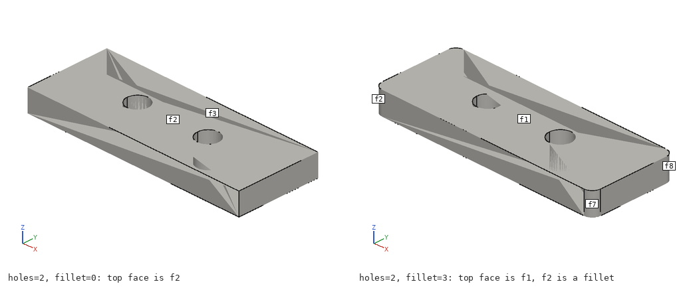

Adding the fillet inserted new faces earlier in the walk order, so every later index
slid. A reference to `p0/f2` that meant "the top face" now means "a fillet face". An
agent that stored `p0/f2` across an edit would fillet the wrong thing.

This is not a BISCAD bug. It is intrinsic to naming faces by regeneration order. BISCAD's
honest position: ids are stable within a build, and stable across pure parameter
changes, and you must re-read topology after a structural edit. The MCP guide text and
the docs say exactly this ("Ids are stable for the same program and parameters").

### How other systems attack TNP

- **Onshape** solved it most completely, with a system often described under the name
  *Topolo­gical Naming*/*deterministic ids*. Onshape assigns each created entity a
  persistent id at the moment the feature creates it, derived from the operation and its
  inputs, and tracks those ids through later operations. A face keeps its id across
  edits because the id is stored, not recomputed from position. This is a major reason
  Onshape's parametric edits are robust, and a major reason its system is proprietary
  and complex.
- **FreeCAD** suffered TNP badly for years (references breaking on edit was the top user
  complaint). The long-running "Toponaming" fix, merged for FreeCAD 1.0, assigns and
  tracks string names for sub-shapes through operations, mapping new sub-shapes back to
  the elements that generated them. It is based on Realthunder's element-mapping work.
- **Parasolid / ACIS** (commercial kernels) carry attribute/rollback machinery that
  tags entities through the history so references survive.

### Future work for BISCAD

The path to persistent naming in BISCAD is clear and does not need a new kernel:

1. **Record a build history.** The step recorder (Section 8) already wraps every
   operation. Extend it to tag the faces each operation creates.
2. **Use OCCT's `BRepTools_History` / `ShapeHistory`.** OCCT's boolean and feature
   operations can return a history object that maps input sub-shapes to the output
   sub-shapes they became (generated / modified / deleted). Threading that through gives
   each face a lineage: "the top face of the box, as modified by the fillet".
3. **Expose a persistent id alongside the index id.** Keep `p0/f3` for the within-build
   case, and add `p0/#<stable>` that survives edits. The viewer and MCP already carry
   arbitrary id strings, so the plumbing is in place.

This is the single highest-value piece of future work, because robust cross-edit
references are what let an agent refine a design over many rounds without re-reading
everything each time.

---

## 5. Tessellation and the scene format

The viewer and the renderer need triangles, not B-rep. Tessellation turns the exact
surface into a mesh. It lives in `server/tessellate.py`.

### BRepMesh: the incremental mesher

OCCT's `BRepMesh_IncrementalMesh` meshes a shape face by face. Two parameters control
how closely the triangles follow the surface:

- **Linear deflection** (mm): the maximum distance between the mesh and the true
  surface. Smaller deflection, more triangles, closer fit.
- **Angular deflection** (radians): the maximum angle between adjacent facet normals.
  This controls how many facets go around a curve. It is why a small deflection still
  gives a round-looking cylinder.

BISCAD scales the linear deflection to the model's size so a big part and a small part
look equally smooth. `tolerance_for(shape)` computes `deflection = diagonal / divisor`,
clamped to a 0.002 mm floor, where the divisor comes from the quality preset.

### Quality presets

```python
QUALITY = {"draft": (600.0, 0.5), "normal": (2000.0, 0.25), "fine": (6000.0, 0.12)}
#                     divisor  angle(rad)
```

The number is "diagonal / divisor". A larger divisor means a finer mesh. The angle
tightens with quality.

The effect, measured on the flange (one part, 27 faces):

| Quality | Triangles | scene.json |
|---|---|---|
| draft | 834 | 136 KB |
| normal | 1,926 | 267 KB |
| fine | 5,128 | 628 KB |

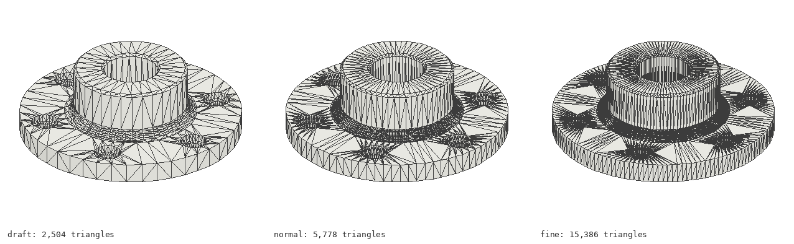

The studio builds at `normal`. Build-step snapshots are meshed at `draft`, because they
are previews and there may be dozens of them (Section 8). You pick quality per build via
the API (`quality` field) or the studio's quality selector.

### Per-face triangle ranges

This is the detail that makes GPU picking work (Section 12). When BISCAD meshes a part, it
concatenates every face's triangles into one buffer **in face order**, and records for
each face the range it occupies:

```json
{"id": "p0/f3", "type": "plane", "area": 2743.27,
 "center": [29.81, 0.0, 0.0], "normal": [0,0,-1],
 "start": 164, "count": 216}
```

`start` is the index of the first triangle, `count` is how many. Triangles of one face
are contiguous, so a picked triangle number maps to its face by a range lookup. This is
why clicking a triangle in the viewer gives you `p0/f3` and not just "some triangle".
(Verified: for the bracket, the face ranges sum exactly to the total triangle count.)

### Normals

Per-vertex normals come from the surface where OCCT can give them
(`Poly_Triangulation.Normal`, computed with `BRepLib_ToolTriangulatedShape` when the
triangulation lacks them). This gives smooth shading on curved faces. If the surface
cannot provide normals, BISCAD falls back to area-weighted face normals accumulated per
vertex. Normals are flipped when the face orientation is `REVERSED`, so they always point
out of the solid.

### Edge polylines

B-rep edges are drawn as crisp lines, not as the boundary of triangles. BISCAD samples
each edge into a polyline with `GCPnts_TangentialDeflection`, which places points so the
chord never deviates from the true curve by more than the deflection, and the tangent
never turns more than a set angle (0.2 rad here). A straight edge gets 2 points; a tight
arc gets many. This is what gives the viewer and renderer their clean CAD look instead
of faceted silhouettes.

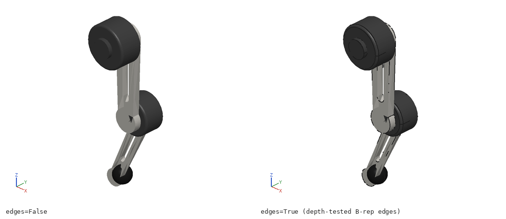

### The scene format, v1

The server sends the viewer one JSON document. The spec (from `tessellate.py`):

```
{
  "format": "biscad-scene", "version": 1, "units": "mm",
  "bbox": {"min": [x,y,z], "max": [x,y,z]},
  "parts": [{
    "id": "p0", "name": "bracket", "color": "#d8d6d0",
    "positions": <b64 float32 xyz>,     # vertex coordinates
    "normals":   <b64 float32 xyz>,     # per-vertex normals
    "indices":   <b64 uint32>,          # triangle vertex indices
    "faces": [{"id":"p0/f3","type":"plane","start":164,"count":216,
               "area":2743.27,"center":[..],"normal":[..]}],
    "edges": [{"id":"p0/e7","type":"line","length":37.0,
               "points": <b64 float32 xyz polyline>}]
  }]
}
```

Field notes:

- **Geometry is base64 of raw typed arrays.** `positions` and `normals` are float32
  triples; `indices` is uint32. The viewer decodes base64 straight into
  `Float32Array` / `Uint32Array` and hands them to three.js with no parsing
  (`viewer.js`, `b64ToArrayBuffer`, `f32`, `u32`). Base64 costs about 33% size over raw
  binary but rides inside one JSON response and gzips well.
- **`faces` carries both the id and the triangle range**, so picking and labelling need
  no extra lookup table.
- **`type`** is the OCCT geometry kind: `plane`, `cylinder`, `cone`, `sphere`, `torus`,
  `line`, `circle`, `bspline`. Curved faces also carry `radius` and `axis`; circles
  carry `center`.
- **`topology.json`** is a sibling document with the same descriptors but no mesh
  buffers. That is what the REST `/topology` endpoint and the MCP `get_topology` tool
  return, so an agent reads face geometry without downloading megabytes of triangles.

### Size math

For one part, the raw buffer bytes are approximately:

```
positions:  V vertices × 3 × 4 bytes
normals:    V vertices × 3 × 4 bytes
indices:    T triangles × 3 × 4 bytes
edges:      S segments × 2 × 3 × 4 bytes   (both endpoints)
```

Base64 multiplies that by ~1.33, and the face/edge descriptor JSON adds a few hundred
bytes per face. Measured for the bracket at normal quality: 1,392 vertices, 460
triangles, 448 edge segments give a raw prediction of ~50 KB; the actual `scene.json`
is 83 KB, the difference being base64 overhead plus the descriptor JSON (the bracket's
18 face descriptors are 2.6 KB, its 48 edge descriptors 5.9 KB). The scene gzips to
about 18% of its size on the wire (the server runs GZip middleware).

Scenes range from tens of KB (a bracket) to a few MB (the 23-part quadruped at ~6 MB
normal). Over gzip and an `immutable` cache header, this is fine for the web and cheap
for an agent.

---

## 6. Headless rendering

An agent has no screen. A server has no GPU. But a multimodal model must *see* the part
to check it, and the design report must embed pictures. So BISCAD ships a software
renderer: `server/render.py`, Pillow and NumPy only, no OpenGL.

### Why no GPU

GPU rendering on a server means a headless OpenGL context, a GPU in the box, and driver
pain on Cloud Run and Hugging Face Spaces, which have neither. A pure-CPU renderer runs
anywhere Python runs, in the same container, with no extra dependency. The cost is
speed, and for a still image that cost is small: a normal part renders in 130 to 360 ms
(Section 14). That is fast enough for an agent that is already waiting on the kernel.

### The algorithm: painter's plus a depth image

The renderer is a classic **painter's algorithm** with one addition for correct edges.

1. **Project.** Build an orthographic camera from the requested view direction (`iso`,
   `front`, `top`, or an arbitrary `x,y,z`). Project every triangle vertex to 2D and
   keep its depth along the view axis. Scale so the model fills the frame with a small
   margin. Render at 2x supersampling, then downscale with Lanczos for clean edges.
2. **Shade.** Per triangle, compute a Lambert term from two lights plus a small Phong
   specular highlight, modulated by the part colour. Faces that are highlighted get
   painted international orange. Both sides are lit, so back faces seen through a hole
   are not black.
3. **Paint back to front.** Sort triangles by depth and draw them in order with Pillow
   polygons. The nearer triangle paints over the farther one. That is the painter's
   algorithm.
4. **Capture a depth image.** While painting the triangles, also paint their depth into
   a separate float image. This is the trick for edges.
5. **Draw visible edges only.** For each B-rep edge polyline, walk it in small steps.
   For each step, compare the edge's depth at that pixel against the depth image. Draw
   the segment only where the edge is at or in front of the surface (within a tolerance).
   This hides edges that are behind the solid, so you get clean hidden-line behaviour
   without a true hidden-line engine.
6. **Labels.** If requested, place each face's id at its projected centre, but only if
   that centre is not occluded (same depth test) and the face is large enough to label.
   A white box behind the text keeps it readable.
7. **A view triad** (X red, Y green, Z blue) goes in the corner so orientation is never
   ambiguous.

`render_grid` renders four views (iso, front, top, right) into one image. The MCP
`render_grid` tool returns it: one picture, full understanding of a part.

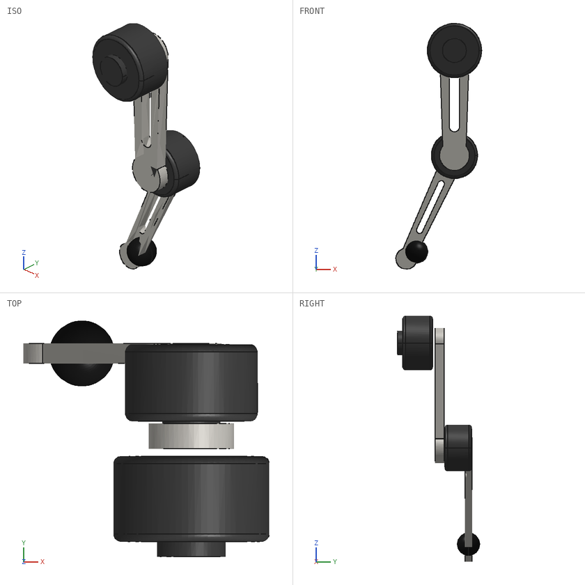

### Limits

- **Per-triangle painting is O(triangles).** A 170k-triangle fine quadruped is slow to
  render. For agent use, normal quality (tens of thousands of triangles) is the right
  operating point.
- **No shadows, no ambient occlusion, no reflections.** The software renderer is for
  *reading* geometry, not for beauty shots. The web viewer (Section 12) does the pretty
  rendering on the client GPU.
- **Approximate edge visibility.** The depth test has a tolerance, so a few edges near a
  silhouette may flicker in or out. It is good enough to read the shape.

### How agents use it

The MCP tools `render_view` and `render_grid` return real image blocks. A multimodal
model gets the picture inside its tool result and checks: are there four legs? Does the
hole go through? Is anything floating? The text-to-CAD loop (Section 11) feeds the agent
a 4-view grid after every successful build and asks "does this match the request?". The
renderer is the agent's eyes.

---

## 7. Sandbox security

BISCAD runs **untrusted Python**. Anyone with a key, and anonymous callers by IP, can
POST a program that the server executes. The whole security model is defence in depth in
`server/kernel.py`, and the known escapes are frozen as tests in `tests/test_api.py`.

### Threat model

The attacker controls the full text of a Python program the server will `exec`. Their
goals: read files (keys, other users' data), write files, run shell commands, open
network connections, or crash/hang the server. BISCAD must allow build123d, NumPy and math
to run freely while denying all of that.

The honest framing from `README.md`: this is best-effort in-process sandboxing. For a
large public deployment, run the container under gVisor or Firecracker as well. The
layers below raise the bar high; they are not a kernel-level jail.

### Layer 1: AST guard

Before anything runs, `parse_and_check_script` walks the AST and rejects:

- **Imports not on the allowlist.** Only `build123d, math, cmath, random, itertools,
  functools, operator, typing, dataclasses, enum, copy, numpy, collections, statistics,
  fractions, decimal, string, re`. No `os`, `sys`, `subprocess`, `socket`, `pathlib`,
  `importlib`, `ctypes`. Relative imports are rejected outright.
- **Dunder attribute access.** Any `.__class__`, `.__globals__`, `.__subclasses__` is a
  classic sandbox-escape primitive (walk from an object to `object.__subclasses__()` to
  arbitrary classes). All `__…__` attribute access is banned.
- **Banned attribute names.** A denylist of I/O and introspection names: `export`,
  `import`, `write`, `read`, `save`, `load`, `open`, `system`, `popen`, `fork`,
  `globals`, `locals`, `vars`, `frame`, `mro`, `subclasses`, plus generator/traceback
  frame attributes (`gi_`, `cr_`, `tb_`, `f_`, `co_`) by prefix.
- **Banned builtins by name** as `Name` nodes: `open`, `exec`, `eval`, `compile`,
  `__import__`, `getattr`, `setattr`, `input`, `breakpoint`, `exit`.
- **Strings containing `__`.** This blocks `"{0.__class__}".format(x)` and
  `getattr`-by-string tricks, because the dangerous name never appears as a literal.

### Layer 2: sanitized module copies

A script never sees a real module. `_sanitized_copy_of_module` builds a fresh module
object holding only public, non-module, non-I/O members of the real module. So
`build123d.os`, `typing.sys`, `re.enum.sys` do not exist in the sandbox: the chain to
the real `os` is cut at the first hop. Sub-modules are dropped entirely (the copy holds
no module-typed attributes), and I/O names like `export_step`, `Mesher`, `ExportSVG`,
`import_brep` are stripped so a script cannot ask build123d to write a file. The guarded
`__import__` returns these copies and nothing else.

This closed a whole class of escapes found in review (now tests):
`build123d.exporters.os.getcwd()`, `import typing; typing.sys`, `numpy.save(...)`,
`numpy.loadtxt('/etc/hostname')`.

### Layer 3: no file writes during user code

Even with exports stripped, a library might try to write. While user code runs,
`_execute_with_file_writes_blocked` sets `RLIMIT_FSIZE` to 0 and ignores `SIGXFSZ`, so
any write of a non-empty file fails. The limit is restored to its real value
immediately after, so BISCAD's own outputs (`scene.json`, `.brep`) write normally. This
is the belt to the sanitized-module suspenders: writing is denied twice.

### Layer 4: resource limits in the forked child

Every build runs in a `fork()`ed child (`run_in_forked_child`) that:

- Calls `setsid()` so the child is its own process group. On timeout the parent kills
  the whole group with `SIGKILL`, so a child that spawned helpers cannot leave orphans.
- Sets `RLIMIT_AS` (address space, default 3 GB), `RLIMIT_CPU` (seconds), and
  `RLIMIT_FSIZE` (512 MB ceiling for legitimate outputs).
- Is `daemon=True` and watched with a wall-clock timeout (30 to 180 s by plan). A hang
  is killed.

Fork isolation also means a segfault in OCCT (invalid geometry can crash the C++ layer)
takes down only the child. The parent sees EOF on the pipe and returns "kernel process
crashed", not a dead server.

### Layer 5: read-only code in Docker

In the container (`Dockerfile`), the server code is copied as root and the process runs
as an unprivileged user (`uid 1000`). Only `/data` is writable by that user. So even if
a script reached the filesystem, it could not modify the server's own code.

### The escapes found during review

These are real escapes caught before launch, each now a locked test
(`test_sandbox_and_errors` in `tests/test_api.py`):

```python
("import build123d\nbuild123d.exporters.os.getcwd()", "not available"),
("from build123d import *\nexport_stl(Box(1,1,1), '/tmp/x.stl')", "not available"),
("from build123d import *\nf = Box(1,1,1).export_step", "not available"),
("import numpy as np\nnp.save('/tmp/x.npy', np.zeros(3))", "not available"),
("import numpy as np\nnp.loadtxt('/etc/hostname')", "not available"),
("import typing\ntyping.sys", "not available"),
("g = (x for x in [1])\ng.gi_frame", "not available"),
("'{0.__class__}'.format(1)", "'__'"),
("from build123d import *\nos", "not available"),
("import build123d.exporters", "not allowed"),
```

They cover: module-hopping to `os`, calling a stripped export, binding a method that
would write, NumPy file I/O, sub-module traversal, generator-frame access, and
format-string class walking. The test suite exists so no refactor silently reopens one.

### Residual risks

- **In-process, same kernel.** A novel OCCT or CPython bug could still breach the
  interpreter boundary. The guard denies the known primitives, not unknown ones.
- **CPU/memory exhaustion up to the limits.** A script can burn its full CPU budget and
  memory ceiling. Rate limits and quotas (Section 13) bound the damage, and the worker
  semaphore bounds concurrency.
- **Side channels.** Timing and memory pressure are not addressed.

**Recommendation for public scale:** run the container under **gVisor** (a user-space
kernel that intercepts syscalls) or **Firecracker** (a microVM per job). Either turns a
breach of the Python sandbox into a breach of a throwaway sandboxed kernel, not the
host. The in-process guard then becomes the first of three walls, not the only one.

---

## 8. Build-step capture

To replay how a part was built, BISCAD records each operation as it happens. The code is
`server/steps.py`.

### Wrapping the one funnel

Every build123d builder-mode operation that changes the part passes through one method:
`Builder._add_to_context`. `StepRecorder.install()` monkey-patches that method with a
wrapper. The wrapper:

1. Remembers the part object before the call.
2. Runs the real operation.
3. If the builder is a `BuildPart`, the mode is not `PRIVATE`, and the part object
   actually changed, records a step.

Because it hooks the one chokepoint, it catches primitives (`Box`, `Cylinder`), feature
ops (`extrude`, `revolve`, `fillet`, `Hole`), and boolean modes alike. The recorder is
installed only during the build and uninstalled after, so it never leaks into another
job.

### Frame walking: finding the op and the line

Knowing *that* the part changed is not enough; the step must say *what* ran and *where*.
The recorder walks the Python call stack from the operation back toward the user's
script:

- It climbs frames until it hits a frame whose filename is `<script>` (the user's code)
  and records that line number. That is the `line` shown in the report and the viewer.
- Along the way it looks for the frame whose `self` is a build123d `Shape` subclass (a
  `Box`, a `Hole`), which names the operation, or failing that the first non-private
  function name in the chain. From that frame's locals it pulls argument values
  (`amount`, `radius`, `length`, `angle`, `depth`, a fillet/chamfer edge `count`).

This is why a step can say "Drill a hole of diameter 6.5 mm" and point at line 17: the
diameter came from the operation's locals, the line from the script frame.

### Controlled-English descriptions

`describe()` turns the operation and its args into one or two short sentences, ASD-STE100
style: one action, active voice, units on numbers, a verb map (`extrude` → "Extrude",
`offset` → "Shell", `Hole` → "Drill a hole"). It adds the volume change and the new face
count. Measured output for the flange:

```
1. Add a cylinder of diameter 90 mm, height 8 mm. Volume increases by 50,894 mm3. The part has 3 faces.
2. Add a cylinder of diameter 46 mm, height 28 mm. Volume increases by 33,238 mm3. The part has 5 faces.
3. Fillet the edges with radius 4 mm. Volume increases by 515 mm3. The part has 6 faces.
4. Drill a hole of diameter 22 mm, through the part. Volume decreases by 10,644 mm3. The part has 7 faces.
5. Drill a counterbored hole of diameter 6.6 mm, through the part. Volume decreases by 2,737 mm3. The part has 25 faces.
6. Chamfer 2 edges with size 1 mm. Volume decreases by 107 mm3. The part has 27 faces.
```

A person reads that like a recipe and knows exactly what the agent did.

### Draft meshing of snapshots

`finalize()` keeps one entry per step that actually changed volume or face count
(it drops no-op or duplicate records). For each kept step, the kernel writes a **light**
directory: a scene and a draft mesh, no `.brep` (`_write_build_step_snapshots`, quality
forced to `draft`). Draft because there can be many steps (the quadruped has 60), and
each is a preview the viewer's steps timeline or the explainer GIF will show small.

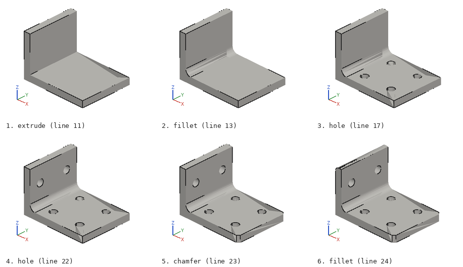

Step meshing is not free: it was ~20% of the quadruped's build time (Section 14),
because meshing 60 intermediate solids is 60 extra tessellations. It is capped at 80
steps (`MAX_STEPS`) to bound the cost.

---

## 9. Analysis algorithms

Analysis runs on a saved version: it loads the `.brep` files inside a forked child and
computes. All of it is in `server/analysis.py`. For each operation below: the math, the
cost, and how it fails.

### measure — distance, angle, parallelism

**Math.** For two entities (`p0/f3`, `p0/e7`, a vertex, or a whole part), the minimum
distance uses OCCT's `BRepExtrema_DistShapeShape`, which finds the closest points
between two shapes exactly (not on the mesh, on the B-rep). Angle comes from the dot
product of the two entities' directions: a plane's normal, a cylinder's axis, a line's
tangent, a circle's normal. `parallel` and `perpendicular` fall out of the cosine.

**Cost.** `BRepExtrema_DistShapeShape` is roughly O(F_a × F_b) in the sub-faces of the
two entities, but entities are small (one face, one edge), so it is milliseconds.
Measured: ~60 ms including the fork and `.brep` load.

**Failure modes.** An unknown ref string raises a clear error. Entities with no
direction (a sphere face, a spline) give a distance but no angle.

The viewer computes a fast approximate measure on the client for instant feedback, then
calls this endpoint and replaces it with the exact kernel answer (Section 12).

### section — a half-space boolean

**Math.** To cut the model with a plane, BISCAD intersects every part with a very large
half-space box (1e5 mm) positioned on the plane: `kept = shape & half`. The cut faces are
the faces of the result that lie in the plane (centre on the plane, normal parallel to
the plane normal). Their total area is the section area. An SVG is drawn by projecting
those faces to the plane's local 2D frame and filling them with a hatch pattern.

**Cost.** One boolean per part, so O(parts) booleans; a boolean is the expensive
operation. Measured ~33 ms for the one-part flange.

**Failure modes.** A boolean that fails on a bad solid skips that part (caught). A plane
that misses the model gives zero area and an empty SVG.

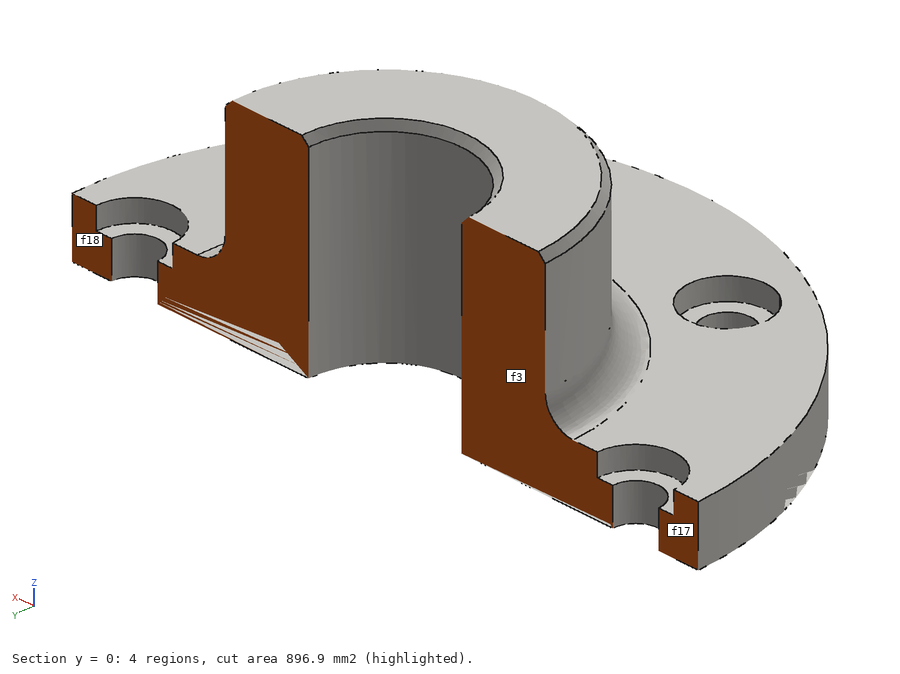

### mass — GProp and the inertia tensor

**Math.** OCCT's `BRepGProp.VolumeProperties_s` integrates over the solid to give volume,
centre of mass, and the inertia matrix about the centre of mass. BISCAD multiplies by the
density (g/cm3, converting mm3 → cm3) to get mass in grams, and scales the inertia into
**kg·mm²**. For an assembly it sums masses and computes the combined centre of mass as
the mass-weighted mean.

**Cost.** One volume integration per part. Measured ~5 ms for the flange. Verified
against the summary: mass equals volume/1000 × density to within rounding.

**Failure modes.** An open or invalid shell gives a meaningless volume; the validity
flag warns you. Units are the usual trap, so the response labels every field
(`mass_g`, `inertia_kg_mm2_about_com`).

### DFM checks — overhang, min wall, tiny edges

`check(process)` runs design-for-manufacturing rules for `fdm`, `cnc` or `sheet`.

- **Build envelope.** Compare the sorted bounding-box dimensions to the process envelope
  (FDM 256³, CNC 600×400×300, sheet 1500×3000×50 mm). Error if it does not fit.
- **Validity and disconnected solids.** Report invalid solids and parts made of multiple
  disconnected lumps.
- **Tiny edges.** Any edge shorter than 0.2 mm is flagged (often a sliver from a failed
  boolean; hard to manufacture). O(edges).
- **Overhangs (FDM).** For each face, if its normal points more than 45° below
  horizontal (`normal.Z < -0.707`) and it is not on the build plate, it needs support.
  BISCAD reports the face refs and the overhang area fraction. O(faces).
- **Min wall estimate (ray casting).** From each face centre, shoot a ray inward along
  `-normal` with `BRepIntCurveSurface_Inter` and take the nearest exit distance. The
  smallest over all faces is the estimated minimum wall thickness. Capped at 400 faces
  for cost. This is an estimate, not a medial-axis thickness, but it catches thin walls
  cheaply. O(faces × intersection cost).

Measured: on the enclosure, the check finds the correct overhanging vent faces and
estimates a 2.4 mm minimum wall. On the whole quadruped (23 parts) the check takes
~3.2 s because it is 23 parts × hundreds of faces of ray casting.

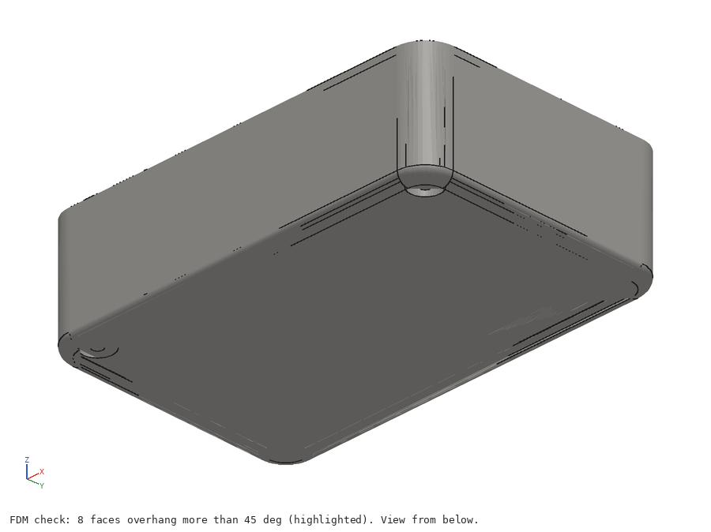

**Failure modes.** Ray casting from a point exactly on a surface can miss; a 1e-3 mm
back-off handles it. The overhang test assumes the part prints in its modelled
orientation.

### diff — geometric comparison of two versions

**Math.** Given versions A and B, BISCAD computes `B - A` and `A - B` as booleans to get
volume added and removed, and compares face *signatures* (type, rounded area, rounded
centre) as sets to count faces added and removed. `identical` is true when both
signature sets match and volumes agree.

**Cost.** Two booleans plus set operations. Measured ~60 ms for the bracket. The
signature comparison is a heuristic: it can be fooled by two different faces with the
same area and centre, but in practice it is a good, cheap diff.

**Failure modes.** A boolean that fails records `boolean_error` and still returns the
face/volume comparison.

### interference — clash detection

**Math.** For every pair of parts in an assembly, first test their bounding boxes. If
the boxes do not overlap, the parts cannot clash, so skip (the **bbox prefilter**,
O(n²) cheap tests). Only for boxes that overlap does BISCAD compute the actual common
volume `a & b` (the expensive boolean) and report pairs whose overlap exceeds a
tolerance, sorted by volume, with the clash centre.

**Cost.** O(n²) bbox tests plus one boolean per candidate pair. The prefilter is what
makes it affordable: measured on the 23-part quadruped, only 18 of 253 pairs survive the
prefilter, and the whole check is ~2.25 s. Without the prefilter it would be 253
booleans.

**Failure modes.** Touching-but-not-overlapping parts may register a tiny overlap from
tolerance; the tolerance threshold filters those.

### BOM — grouping identical parts

**Math.** Group parts by a signature of (rounded volume, rounded area, face count,
sorted bounding-box size). Parts with the same signature are treated as the same item
and counted. Items are sorted by quantity.

**Cost.** O(parts), plus the per-part property reads. Measured ~1 s for the quadruped,
dominated by reading volume/area/faces for 23 parts. Verified: it groups the quadruped's
23 parts into 8 unique items, and in a test with three identical boxes it reports
quantity 3.

**Failure modes.** The signature is a heuristic. Two genuinely different parts with the
same volume, area, face count and bounding box would be merged. Mirror-image parts
(left/right) have the same signature and are grouped, which is usually what a BOM wants
but not always.

---

## 10. Exports, imports and drawings

### 3D exchange formats

`analysis.export(vdir, fmt)` loads the `.brep`, assembles a compound (named, coloured),
and writes the requested format, caching the file so a second request is instant.
Supported: `step`, `stl`, `glb`, `3mf`, `brep`, `obj`, plus the 2D `svg`/`dxf` drawings.

- **STEP** (`export_step`) is the exact B-rep interchange format: the right choice to
  move the model to another CAD system. Measured ~13 ms, 75 KB for the flange.
- **STL / 3MF / GLB** are meshes for printing and web: tessellated at a fixed tolerance.
  3MF carries colour and units; GLB is the web/AR mesh. 3MF is slower (~226 ms) because
  it re-meshes through OCCT's `Mesher`.
- **BREP** is OCCT's native dump, fastest of all (~1 ms) and the format BISCAD stores
  internally.
- **OBJ** is written directly from the cached `mesh.npz`, so it needs no kernel work.

### Imports

`POST /v1/import` accepts STEP, STP, BREP and STL. The file is saved, then a forked child
imports it (`import_step` / `import_brep` / `import_stl`), tessellates it into the same
scene format, and stores it as a new document's first version. A round-trip is tested:
export the flange to STEP, re-import it, and the face count matches.

### Drawings: HLR projection to SVG and DXF

A 2D engineering drawing needs the part's silhouette and visible edges projected flat,
with hidden edges dashed. That is **hidden-line removal (HLR)**, and OCCT does it.

`_drawing()` lays out four views (front, top, right, iso) on a sheet. For each, it calls
`shape.project_to_viewport(...)`, which runs OCCT's HLR algorithm and returns two edge
sets: visible and hidden. BISCAD writes the visible edges to a "visible" layer and the
hidden edges to a dashed "hidden" layer, via build123d's `ExportSVG` / `ExportDXF`. SVG
is for viewing, DXF for CAM and laser cutters.

HLR is the most expensive export because it is a full projection-and-occlusion pass per
view. Measured on the flange: SVG ~690 ms, DXF ~400 ms. That is the price of a real
drawing with correct hidden lines, and it is still well under a second.

---

## 11. Text-to-CAD agent loop and MCP tool design

### The loop: write, build, look, fix

`server/agent.py` is the text-to-CAD feature. It needs `ANTHROPIC_API_KEY` on the
server; without it, `/v1/agent` returns 501 and the studio's Ask box is disabled. The
loop is BISCAD's own, not a generic tool runner:

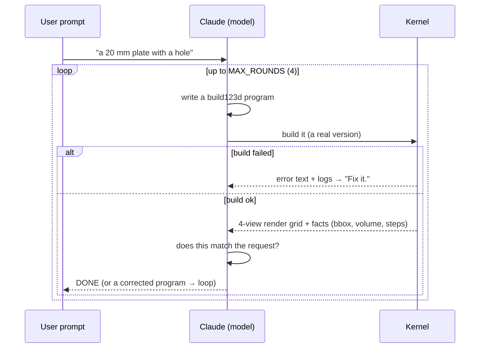

Design decisions:

- **Every round is a real version.** The agent's attempts are saved versions with
  parent links, so the user can scrub through the agent's thinking, not just see the
  final answer. The studio shows round chips (R1, R2, …) you can click.
- **Render-and-fix.** After a good build, the agent is shown a 4-view grid (the software
  renderer, Section 6) and the build steps and asked to verify against the request. This
  is the Karpathy loop made literal: the model checks its own output visually.
- **Errors feed back.** A failed build sends the error and the last 1,500 characters of
  logs back with "Fix it." A build123d error names the script line, so the model edits
  the right place.

### Cost control and quota gating

Each agent run spends the server owner's Anthropic credits, so it is gated hard:

- **Auth required.** Anonymous callers get 401. Text-to-CAD needs a key.
- **Per-plan monthly cap.** `agent_runs_month` (free plan default 10, from
  `BISCAD_FREE_AGENT_RUNS`). Tracked in a separate usage bucket (`agent:<owner>`), so
  agent runs do not eat the build quota and vice versa. Over cap → 402.
- **Bounded rounds.** `MAX_ROUNDS` (default 4) caps the number of model turns, so one
  prompt cannot loop forever and drain credits.

### Fallbacks

The model call (`_ask`) asks for medium effort and passes server-side fallbacks, so a
transient overload of the primary model falls back rather than failing. API errors map
to clean HTTP codes: rate limit → 429, bad credentials → 501, refusal → 422, connection
failure → 502. The studio shows a human message for each.

### MCP tool design for agents

The MCP server (`server/mcp_server.py`) mirrors the REST API as tools, but the shape of
the tools is tuned for a model, not a human:

- **Images in results.** `build_model`, `render_view` and `render_grid` return real
  image blocks, so a multimodal agent sees the geometry inside the tool result. A build
  comes back as a compact JSON summary *plus* a labelled iso render.
- **Compact JSON.** `_brief()` strips the summary to what matters (bbox, volume, mass,
  per-part validity, build steps as one-liners, a viewer URL, a report URL) and
  serialises with no whitespace. Small results keep the agent's context cheap.
- **One guide text, shared.** `GUIDE` is a single document: the allowed imports, the
  `result =` / `show(...)` contract, the `params = {...}` rule, the `p0/f3` reference
  scheme, and a build123d cheat sheet. It is the MCP server's `instructions`, and the
  text-to-CAD system prompt prepends it, so the agent learns the rules once and the REST
  and MCP paths teach the same thing.
- **Stable ids everywhere.** Every tool speaks `p0/f3`. `get_topology` returns ids and
  geometry; `measure`, `section`, `check_manufacturability` take ids; `render_view`
  highlights ids. The agent points, the human sees the same highlight.

The workflow the guide recommends: `build_model` → look at the render → `get_topology`
to find ids → `measure` / `section` / `check` → `export_model`.

---

## 12. Web viewer and studio internals

The viewer is `web/js/viewer.js`, a reusable three.js ES module (`new Viewer(container,
opts)`). It is the biggest single file in the project (~2,270 lines) and the one that
makes the geometry feel like a real CAD viewer. three.js and CodeMirror are vendored
under `web/vendor/` and loaded via an import map; there is no build step.

### Scene construction from base64 buffers

`loadScene` decodes the scene (Section 5). For each part, `_buildPart`:

- Decodes `positions`, `normals`, `indices` straight from base64 into typed arrays and
  sets them as `BufferAttribute`s on a `BufferGeometry` with zero copying or parsing.
- Builds a `MeshPhysicalMaterial` tuned per part colour (dark parts get a little
  clearcoat and metalness so the quadruped's black motors read well).
- Decodes edge polylines into a `LineSegments2` (fat lines) so B-rep edges stay crisp at
  any zoom.
- Up axis is Z (`THREE.Object3D.DEFAULT_UP.set(0,0,1)`), matching CAD convention.

### GPU id picking

Clicking a face must return `p0/f3` exactly. The viewer uses **GPU colour picking**:

1. Each triangle gets a per-vertex `pickId` attribute: an integer naming its face
   (assigned from the same face ranges as the scene; `_buildPart` fills `pick[]` over
   each face's `start..start+count`). Edges get an instanced `instanceEdgeId`.
2. A tiny custom shader (`PICK_VS` / `PICK_FS`) encodes that integer id into an RGB
   colour (`vcEncode`: id split across R, G, B channels).
3. On click, `_pickAt(x, y)` swaps every part to the pick material, sets a 1×1 camera
   view offset at the cursor, renders into a 1×1 render target, and reads back the one
   pixel with `readRenderTargetPixels`.
4. The pixel's RGB decodes to the id, which indexes a lookup table (`_pickTable`) back to
   `{part, kind, index}` and then to `p0/f3`.

This is exact (no raycast math), works for faces and fat-line edges, and is one pixel of
readback per click. A `filter` lets the studio restrict picking to faces, edges or whole
parts.

### Section: clipping plane plus back-face caps

Sectioning uses three.js **local clipping planes**. `_applySection` builds one
`THREE.Plane` from the section normal and offset and pushes it into the shared
`clipPlanes` array that every material references. The GPU clips away everything on one
side.

A raw clip leaves the solid looking hollow. So each part also has a **cap mesh**: the
same geometry drawn with `side: THREE.BackSide` and a flat hatched shader
(`onBeforeCompile` injects a diagonal-line pattern). The back faces, seen through the
cut, paint the interior as a solid hatched cross-section, so a sectioned part looks
filled, like an engineering section view. The cap is hidden in x-ray mode and during
picking.

Changing the number of clip planes forces a material recompile, which is why
`_applySection` flips `needsUpdate` on every affected material.

### Measure: fast client, exact kernel

When you pick two entities, `_runMeasure` computes a measurement immediately on the
client: centre-to-centre, parallel-plane distance, axis-to-axis, line-to-line closest
approach (`segSegClosest`, a standard segment-segment closest-point solver), face-to-edge
distance and angle. This is instant feedback. Then, if a `measureProvider` is wired (the
studio passes `/v1/versions/{id}/measure`), it calls the kernel for the **exact**
`BRepExtrema` distance and replaces the client estimate, tagging the result
`source: "kernel"`. Fast first, exact second.

### Explode

`_computeExplodeDirs` gives each part an explosion direction: the vector from the
model centre to the part centre. Parts near the centre get a fanned-out radial direction
so they do not pile up. `_applyExplode` scales each part along its direction by the
explode amount; `animateExplode` eases it over 600 ms. The toolbar slider and the `X`
key drive it. Explode is hidden for single-part models.

### Other viewer features

- **Render modes:** shaded+edges, shaded, hidden-line, wireframe, x-ray.
- **Contact shadows:** two depth-rendered, blurred shadow layers (tight contact plus
  broad ambient) for a grounded look, all on the client GPU.
- **Optional GTAO** ambient occlusion, lazy-loaded from three addons, with fat lines and
  helpers excluded from the AO buffer.
- **View cube, infinite fading grid** (a shader that fades with distance and draws
  coloured X/Y axes), **bounding box, screenshot.**
- **StepsBar:** replays build steps, ghosting the previous step behind the current one so
  added/removed material reads clearly. It loads each step's light scene on demand from
  its `scene_url`.

### Embed mode

`view.html?v=<id>&embed=1` strips the chrome (toolbar, panels, grid, steps), makes the
background transparent, disables picking unless `&pick=1`, and can auto-rotate. The
studio's share dialog produces the `<iframe>` snippet. `?api=` overrides the backend
origin, so a viewer hosted anywhere can point at any BISCAD server.

### The studio

`web/js/studio.js` wires a CodeMirror editor, a parameter panel, the viewer and version
history against the v1 API.

- **Live parameters.** It reads `params = {...}` from the script locally for instant
  sliders, then the server's `param_schema` wins. Moving a slider debounces and
  rebuilds (`scheduleBuild`), so the model updates as you drag.
- **Build on demand** with a race guard (`buildSeq`): a stale build result is dropped if
  a newer build started.
- **Offline demo.** If the API is unreachable, the studio loads sample scenes from
  `web/samples/*.json`, so the viewer works with no backend.
- **Ask box** for text-to-CAD, with round chips and a live "round N · Ns" status.
- **Agent view modal** shows exactly what an agent sees: the labelled render URL.

---

## 13. Data model, accounts, quotas, versions

### Store

`server/store.py` is SQLite (WAL mode) plus a files tree under `data/versions/<vid>/`.
Four tables:

- **keys** — API keys (SHA-256 hashed, never stored raw), email, plan.
- **documents** — owner, name, public flag, head version.
- **versions** — the build record: script, params, status, error, logs, summary,
  param_schema, steps, parent, owner. The geometry itself lives in the files tree, not
  the DB.
- **usage** — per owner per month: builds, calls, compute_ms.

### Accounts and the capability model

- **API key.** `POST /v1/keys {email}` returns `bsc_...`. The key hashes to a row; the
  raw key is shown once. `BISCAD_ADMIN_KEY` seeds an unlimited key for the owner.
- **Anonymous = IP bucket.** No key means the `anon` plan, metered by IP, with a small
  playground quota. This lets the landing page and embeds work with no sign-up.
- **Version id = capability link.** A version id is unguessable
  (`secrets.token_urlsafe`). Anyone holding it can view, render and export that version:
  that is how share links and embeds work without auth. **Documents**, by contrast, are
  listed and modified only by their owner's key (or are explicitly `public`). The test
  suite checks that another key gets 404 trying to add a version to your document.

### Quotas and rate limiting

`server/core.py` decides, for every request, before any work:

- **Rate limit** — a token bucket per owner, refilled at the plan's requests-per-minute.
  Over → 429.
- **Build quota** — builds per month and compute-ms per month, per plan. Over → 402 with
  a message pointing to a free key.
- **Concurrency** — a bounded semaphore (`BISCAD_WORKERS`, default = CPU count) caps how
  many kernel children run at once. Over the wait → 503.

Plans (from `store.py`):

| Plan | builds/mo | compute s/mo | req/min | build timeout | agent runs/mo |
|---|---|---|---|---|---|
| anon | 300 | 600 | 30 | 30 s | 0 |
| free | 2,000 | 3,600 | 120 | 60 s | 10 |
| pro | 100,000 | 200,000 | 600 | 180 s | 1,000 |
| unlimited | huge | huge | huge | 600 s | huge |

The Pro/Scale tiers on the landing page are copy only. No billing is wired; nothing was
purchased. The plans exist in code so the quota machinery is real and testable.

### Versions as capabilities and branches

A document is a tree of versions. Each version has a `parent`, so you can branch from any
point (not just the tip). `new_version` defaults the parent to the document head but
accepts any parent. A version reuses its parent's script if you send only new params, so
"same design, width 80" is one small call. The geometric `diff` (Section 9) compares any
two versions. This is configurations and branching without a feature-tree UI: it is just
builds with parents.

---

## 14. Performance: measured numbers

All numbers below were measured on this machine for this handbook: a 4-vCPU Intel Xeon
at 2.10 GHz, 15 GB RAM, build123d 0.13.0 on OpenCascade, Python 3.11. Builds were run
through the in-process kernel (`server/kernel._build_job`) so the timings are the real
mesh-and-capture cost, not network.

### Build time, mesh size, render time per example

At **normal** quality, with the renderer timings for the iso view (800×600), a labelled
iso, and the 4-view grid:

| Example | Parts | Faces | Edges | Triangles | Steps | exec ms | total ms | scene KB | scene gz KB | render ms | render+labels ms | grid ms |
|---|---|---|---|---|---|---|---|---|---|---|---|---|
| bracket | 1 | 18 | 48 | 460 | 6 | 102 | 308 | 81 | 15 | 143 | 133 | 278 |
| flange | 1 | 27 | 51 | 1,926 | 6 | 126 | 373 | 267 | 62 | 249 | 229 | 596 |
| enclosure | 1 | 83 | 200 | 2,249 | 5 | 271 | 759 | 345 | 68 | 241 | 233 | 533 |
| gear | 1 | 392 | 1,170 | 926 | 3 | 457 | 2,141 | 381 | 63 | 246 | 265 | 512 |
| leg | 5 | 71 | 129 | 7,565 | 14 | 266 | 870 | 869 | 249 | 356 | 357 | 1,239 |
| quadruped | 23 | 1,128 | 2,616 | 50,870 | 60 | 2,553 | 9,692 | 6,188 | 1,818 | 1,873 | 1,913 | 6,459 |

Notes:

- **exec** is the time running the user's build123d program (the booleans, fillets,
  holes). **total** is exec plus tessellation, step-snapshot meshing, and summary.
- A **simple part is sub-second end to end.** Bracket 0.31 s, flange 0.37 s. This is the
  common case for an agent, and it is the number the whole pricing argument rests on.
- The **gear** has many teeth, so it has 392 faces and 1,170 edges even though its
  triangle count is modest: exec is dominated by building the involute profile and the
  tooth geometry, not meshing.
- The **quadruped** (23 parts, 60 steps) is the stress case at ~9.7 s. It is a full robot
  assembly, not a typical agent iteration.

### Triangle budget across quality

| Example | draft tris | normal tris | fine tris |
|---|---|---|---|
| bracket | 244 | 460 | 929 |
| flange | 834 | 1,926 | 5,128 |
| enclosure | 969 | 2,249 | 6,612 |
| leg | 2,583 | 7,565 | 23,264 |
| quadruped | 17,716 | 50,870 | 169,460 |

Fine quality roughly 2–3x's the triangles of normal. Draft roughly halves them. The
quadruped at fine produces an 18 MB scene; normal (6 MB) is the right default.

### Where the time goes: a profiled heavy build

`cProfile` on the quadruped build (23 parts, 60 steps, in-process, ~12 s under the
profiler) ranks the cumulative cost like this:

| Phase | Share of build | What it is |
|---|---|---|
| Final mesh (`write_shape_dir` → `build_scene` → `mesh_shape`) | ~2.2 s | Tessellating the 23 final parts into the scene and buffers |
| Step snapshots | ~1.9 s | Draft-meshing the 60 intermediate solids |
| Summary (`summarize_parts`) | ~2.3 s | Per-part volume, area, bbox, **validity** |
| The user program (`exec`) | ~2.6–2.9 s | build123d operations |
| JSON serialisation | ~1.4 s | Writing the scene/topology/step JSON |

By single C++ function (`tottime`):

- **`BRepAlgoAPI.Build`** (~1.47 s) — the boolean engine. Every union and cut.
- **`is_valid`** (~1.28 s) — B-rep validity checking, called per part in the summary.
- **`_mesh_face`** (~1.72 s cumulative, ~0.82 s own) — pulling triangles out of OCCT
  one node at a time in Python.
- **`BRepBndLib.AddOptimal_s`** (~0.86 s) — optimal bounding boxes.
- **`BRepGProp.SurfaceProperties_s`** / **`VolumeProperties_s`** (~0.7 s) — area and
  volume integration.

The lesson: for a heavy assembly, time is split roughly evenly between **computing the
geometry** (booleans), **checking it** (validity, bounding boxes, mass properties), and
**turning it into triangles and JSON** (meshing, serialisation). The per-vertex,
per-triangle Python loop in `_mesh_face` is the one piece of BISCAD's own code that could
be vectorised to claw back time; the OCCT calls are irreducible.

For a simple part none of this matters: the whole thing is a few hundred milliseconds
and dominated by the one-time cost of the operations themselves.

### Fork overhead

A bare forked round-trip (`run_in_forked_child(lambda: 1)`) is ~14 ms. A full box build
through the fork path (guard, fork, build, mesh, write, return) is ~48 ms for 5 builds,
so ~10 ms each of real work on top of fork. Because build123d/OCCT is preloaded in the
parent, the fork is cheap; a fresh `spawn` would re-import OCCT and cost over 2 s (the
measured import time of build123d alone was 2.1 s).

---

## 15. Deployment and scaling

One Dockerfile serves five deployment paths (`README.md`, `deploy/`).

### Docker

The image (`Dockerfile`) is `python:3.11-slim` plus the OCCT runtime system libraries
(`libgl1`, `libglib2.0-0`, `libgomp1`, fontconfig, DejaVu fonts for render labels). The
server code is copied as root; the process runs as `uid 1000`; only `/data` is writable.
`uvicorn` serves REST + MCP + static web on one port. A `HEALTHCHECK` hits `/v1/health`.

### Cloud Run autoscaling, with caps

`deploy/cloudrun.sh` deploys to Google Cloud Run: 2 vCPU, 4 GiB, concurrency 8,
**scales 0 → `BISCAD_MAX_INSTANCES` (default 2)**. Scaling to zero means an idle service
costs nothing. The hard max-instance cap is the money guard rail required by `AGENTS.md`
("autoscaling deploys must cap max instances"). The script also sets a **$5 budget
alert** if it finds a billing account. The in-app rate limits and quotas bound per-caller
load inside each instance.

### Hugging Face Spaces

`deploy/huggingface.sh` pushes to a free Space (Docker SDK, 2 vCPU / 16 GB, no card).
Permanent free hosting. The catch, stated plainly: Space storage is ephemeral, so
documents reset on restart unless you point `BISCAD_DATA` at persistent storage.

### Cloudflare quick tunnel

`deploy/public.sh` runs BISCAD locally (Docker or a venv) and opens a free Cloudflare
quick tunnel, printing a public `trycloudflare.com` URL with no account. This is the
"share it from my laptop in 30 seconds" path.

### Cost model: per build vs per Onshape call

Cloud Run request-based pricing in a Tier 1 region is **$0.000024 per vCPU-second** and
**$0.0000025 per GiB-second**, with a monthly free tier of **180,000 vCPU-seconds** and
**360,000 GiB-seconds** (Google Cloud Run pricing). Take a typical agent build: ~0.3 s of
wall time on 2 vCPU and 4 GiB.

```
CPU:    0.3 s × 2 vCPU × $0.000024   = $0.0000144
Memory: 0.3 s × 4 GiB × $0.0000025   = $0.0000030
Total  ≈ $0.000017 per build  (about 1/60,000 of a dollar)
```

The free tier alone covers roughly 180,000 / (0.3 × 2) ≈ **300,000 builds per month** at
no cost. Even paid, a build is well under a hundredth of a cent.

Compare Onshape. A Professional seat is $2,500 per year for 5,000 API calls, so the
*marginal* cost once you hit the wall is effectively "buy another $2,500 seat", i.e.
**$0.50 per call** amortised over the allowance, and then a hard 402 stop. BISCAD's build
is roughly **four orders of magnitude cheaper** than an Onshape API call, and it does not
stop at an annual wall. That gap is the entire reason the project exists (Section 1).

---

## 16. Testing strategy

Tests are `tests/test_api.py`, run with `python -m pytest -q tests`. They are end-to-end
against the real app via FastAPI's `TestClient`: real kernel, real store, real renderer,
real MCP. 41 tests, all green (re-verified for this handbook against a snapshot of the
server code).

What they cover:

- **Every example builds, is valid, and captures steps.** Parametrised over all six
  examples. This catches regressions in build123d usage, tessellation and step capture at
  once.
- **Scene format invariants.** First face is `p0/f0`; the base64 index buffer length
  equals the summed triangle count × 3 × 4 bytes. This locks the on-wire contract.
- **Parameter override and coercion**, including a string `"30"` coerced to int.
- **Sandbox escapes as locked tests** (Section 7). The known escapes are frozen so a
  refactor cannot silently reopen one. This is the most important test group for a
  service that runs untrusted code.
- **All exports produce non-trivial files**; STEP round-trips through import with the
  face count preserved.
- **Render, grid, explainer GIF, report** all return images / HTML.
- **Every analysis op** (measure, section, mass, check, topology filter, diff,
  interference, BOM) with value assertions (e.g. the three-box clash volume is 500 mm³;
  BOM groups three identical boxes as quantity 3).
- **Documents, versions, branching, ownership** (another key gets 404).
- **Auth and quotas** (bad key → 401, anonymous flagged).
- **MCP protocol**: initialize, tools/list contains the core tools, a `build_model` call
  returns JSON plus an image block.
- **The agent loop with a fake model**: a monkeypatched `_ask` returns a bad program,
  then a good one, then `DONE`, and the test asserts the error was fed back and the
  render image was shown. This tests the loop without spending credits.

The philosophy: test the contract at the edge (HTTP in, JSON/images out), run the real
geometry kernel, and freeze every security escape as a permanent test. There are no
mocks of the kernel; a passing suite means real parts really built.

---

## 17. Roadmap

BISCAD matches Onshape's API on build, reference, analysis, export and versioning, far
more cheaply. Onshape still has four things BISCAD lacks. Here is each, and how to add it,
mostly in few lines, because the model is code and the kernel is OCCT.

### Sketches with a constraint solver

Onshape sketches are dimensionally constrained: you draw roughly, add "this edge is
10 mm, these two are parallel, this is tangent", and a solver places the geometry.
build123d sketches are imperative (you give coordinates). To add constraints: wrap a 2D
geometric constraint solver (OCCT has `PlaneGCS`-style building blocks, or vendor
FreeCAD's `planegcs`) and expose a small sketch DSL that emits solved coordinates into a
build123d `BuildSketch`. The build-step and reference machinery already handle whatever
geometry comes out. Estimate: a new `sketch.py` plus one MCP tool.

### Assembly mates

Onshape assemblies position parts by mates (coincident, revolute, slider) with degrees of
freedom. BISCAD assemblies are parts placed by explicit `Location`. To add mates: define
mate connectors as named frames on parts (a face id plus an axis, which the reference
system already names), solve the transforms that satisfy the mate set, and apply them as
`Location`s before building the `Compound`. Interference checking (Section 9) already
validates the result. Estimate: a `mates.py` solver over existing references.

### PDM and release management

Onshape has part numbers, revisions, and release workflows. BISCAD has documents and
versions. To add release: a `released` flag and a revision label on a version, an
immutable copy on release, and a BOM export (already built) tagged with revisions. This
is mostly store and API work, no kernel change. Estimate: a few columns and endpoints.

### Real-time collaboration

Onshape has multiple cursors in one document. BISCAD is single-writer per document. To add
collaboration: a WebSocket channel per document broadcasting version events and viewer
selections, and optimistic version creation. The viewer already emits selection and
state events; the capability-link model already lets many clients view one version.
Estimate: a WebSocket endpoint and a thin client channel.

The theme: because a BISCAD model is a program and the kernel is OCCT, most of what
Onshape's UI provides is a small amount of code on top of machinery BISCAD already has.

---

## 18. Glossary

- **ASD-STE100** — Simplified Technical English, the controlled-English style used for
  BISCAD prose and step descriptions: short active sentences, one idea each, units on
  numbers.
- **B-rep** — boundary representation. A solid stored as exact trimmed surfaces and
  curves stitched into a watertight shell. See Section 3.
- **Boolean** — union, cut or intersect of two solids. The core and costliest B-rep
  operation.
- **BRepMesh** — OCCT's incremental surface mesher. Turns B-rep faces into triangles.
- **build123d** — the Python CAD library BISCAD runs; a code-first wrapper over OCCT.
- **Capability link** — an unguessable id that grants access by possession. BISCAD version
  ids work this way.
- **Chamfer / Fillet** — replace an edge with a flat bevel / a rounded blend surface.
- **CSG** — constructive solid geometry; a boolean tree of primitives.
- **Deflection** — the allowed gap (linear, mm) or angle (angular, rad) between a mesh
  and the true surface. Controls mesh density.
- **DFM** — design for manufacturing. BISCAD's `check` finds overhangs, thin walls, tiny
  edges, over-size parts.
- **GProp** — OCCT's global properties: volume, area, centre of mass, inertia.
- **HLR** — hidden-line removal. Projecting a 3D solid to 2D with hidden edges dashed,
  for drawings.
- **MCP** — Model Context Protocol. The tool interface agents call BISCAD through.
- **OCCT / OpenCascade** — the open-source B-rep geometry kernel under build123d.
- **Painter's algorithm** — draw triangles back to front so nearer ones cover farther
  ones. BISCAD's software renderer.
- **Scene (biscad-scene v1)** — the JSON document the server sends the viewer: mesh
  buffers plus face/edge descriptors with stable ids. Section 5.
- **TopoDS** — OCCT's topology data structures (Compound → Solid → Face → Edge →
  Vertex).
- **Topological naming problem (TNP)** — face/edge ids shift when a model's structure
  changes, because ids come from regeneration order. Section 4.
- **Tessellation** — converting exact B-rep into triangles.
- **Version** — one built result (script + params → solids + files). The unit of
  storage, sharing and diff.

---

## 19. Reading list

**Geometry kernel and B-rep**

- OpenCascade Technology documentation — Modeling Data and Modeling Algorithms:
  https://dev.opencascade.org/doc/overview/html/
- OCCT `BRepMesh` (incremental meshing) reference and user guide (meshing chapter of the
  OCCT docs).
- OCCT `BRepExtrema`, `BRepGProp`, `BRepAlgoAPI` class references (the exact classes
  BISCAD uses for measure, mass and booleans).
- Mäntylä, M. *An Introduction to Solid Modeling.* Computer Science Press, 1988. The
  classic text on B-rep and Euler operators.
- Hoffmann, C. *Geometric and Solid Modeling.* Morgan Kaufmann, 1989.

**build123d**

- build123d documentation: https://build123d.readthedocs.io — builder vs algebra mode,
  selectors, the operation reference.
- CadQuery (build123d's predecessor in spirit): https://cadquery.readthedocs.io

**Topological naming**

- Onshape's approach to deterministic/persistent ids — Onshape blog and documentation on
  the topological naming problem and why feature references survive edits.
- FreeCAD "Toponaming" / topological naming mitigation (merged for FreeCAD 1.0), and
  Realthunder's element-mapping work:
  https://wiki.freecad.org/Topological_naming_problem
- Kripac, J. "A mechanism for persistently naming topological entities in history-based
  parametric solid models." *Computer-Aided Design*, 1997 — the foundational paper on
  persistent naming.

**Rendering and meshing**

- Foley, van Dam, et al. *Computer Graphics: Principles and Practice* — the painter's
  algorithm, projection, shading models.
- Morten S. Mikkelsen. "Simulation of Wrinkled Surfaces Revisited" (2008) and his notes
  on consistent tangent-space / hex-tiling — on generating stable, aliasing-free surface
  detail and tiling without repetition, relevant to texture and detail work beyond flat
  shading.
- three.js documentation and examples: https://threejs.org/docs/ — clipping planes,
  render targets, LineSegments2.

**Agents and oversight**

- Andrej Karpathy on working with LLMs and keeping humans in the loop (talks and writing
  on AI as tools people must be able to verify) — the motivation for renders, steps and
  reports.
- Model Context Protocol specification: https://modelcontextprotocol.io

**Manufacturing and formats**

- ISO 10303 (STEP) overview — the B-rep interchange standard.
- 3MF Consortium specification: https://3mf.io — colour, units, mesh for printing.

**Service limits and cost**

- Onshape API limits: https://onshape-public.github.io/docs/auth/limits/
- Onshape pricing: https://www.onshape.com/en/pricing
- Google Cloud Run pricing: https://cloud.google.com/run/pricing

---

*End of handbook. The source of truth is the code in `server/`, `web/js/` and
`client/`; where this document and the code disagree, the code wins. Figures in
`docs/img/` were generated by `server/render.py` from in-kernel builds of the example
programs.*
