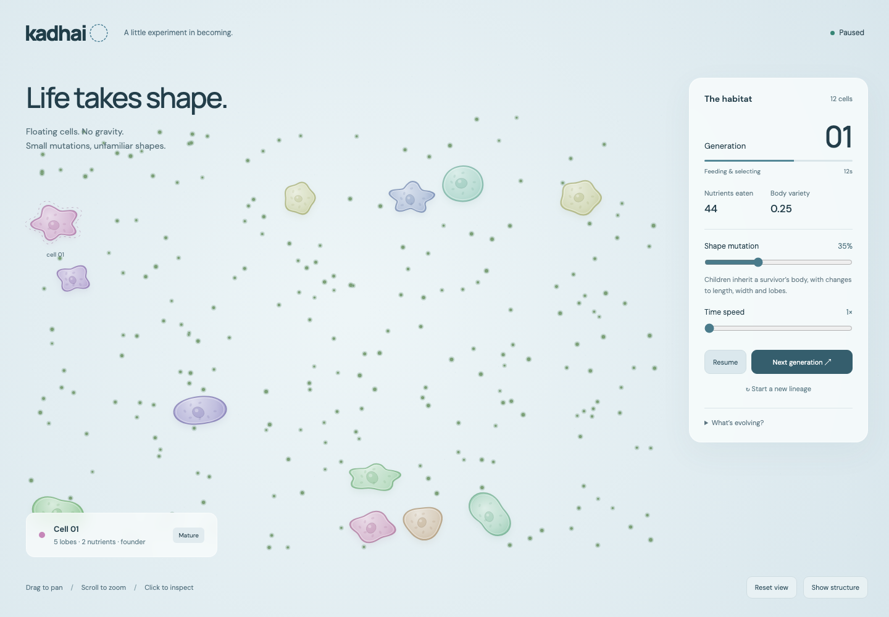

# Kadhai

A rough experiment with floating, growing soft cells and inherited shape changes. Uses [Algovivo](https://github.com/juniorrojas/algovivo) directly for 2D elastic triangles and muscle contraction, with gravity, floor collision, and floor friction all set to zero.

Run locally:

```sh
npm ci
npm run dev
```

Open the localhost URL printed by Vite. `npm run build` produces a static site in `dist/`; `npm run preview` serves that build. No API keys or backend are needed. Algovivo's pinned JS and WASM files are served locally, so physics does not depend on a CDN. The optional Google Fonts stylesheet falls back to system sans-serif offline.

Twelve cells drift through a field of nutrients. They grow from 48% to adult size over 16 simulated seconds by changing the triangles' rest shape and the muscles' rest lengths, while Algovivo computes their deformation. Every 30 simulated seconds, the three highest-scoring cells become parents. Their score is nutrients absorbed minus an accumulated area cost; the best genome is preserved unchanged and the remaining offspring mutate length, width, lobe count, lobe depth, asymmetry, and muscle rhythm.

Drag to pan, scroll to zoom, and click a cell to inspect its lobe count, nutrient intake, growth, and parent. Use pause, speed, shape mutation, next generation, reset, and the mesh toggle to poke at the experiment. Reduced-motion preference starts the simulation paused.

This is not fluid dynamics or a biological model. Currents, viscous damping, soft separation, nutrient absorption, and selection are hand-written rules. Cells use a fixed triangle-fan topology with a bounded lobed outline; they do not invent arbitrary anatomy or divide continuously. Each generation replaces the previous population with juveniles. Selection is noisy because food and starting currents vary, and fitness is not expected to improve monotonically.

Checks:

```sh
npm test
# With the dev server running, and Playwright's Chromium installed:
npx playwright install chromium
node test/browser.mjs
```

`CHROMIUM_PATH` can point to an existing Chromium executable. The tests exercise the actual WASM solver, zero-gravity configuration, nutrient capture, growth, finite state over multiple generations, inheritance, mutation mesh validity, and seeded replay. The browser check captures the running desktop and mobile layouts and exercises the controls. `window.kadhai.snapshot()` provides read-only simulation state for inspection.

The checked seed-42 run completed three selection rounds with 46, 100, and 65 nutrients collected (the first round was advanced manually at 20 simulated seconds). This verifies that feeding and generation turnover happen; it does not establish an evolutionary advantage. Next: compare evolving populations against frozen-genome controls under identical nutrient fields.



Algovivo by Junior Rojas is vendored at build commit `a8d0186`, the revision linked in its quick-start. See [upstream attribution](public/vendor/algovivo/NOTICE.md). Rendering uses Canvas 2D; the physics runs at a fixed 30 Hz, independent of rendering frame rate.
